# UML revisado — sem autenticação

## Figura 1 — Aura Lab — Representação arquitetural
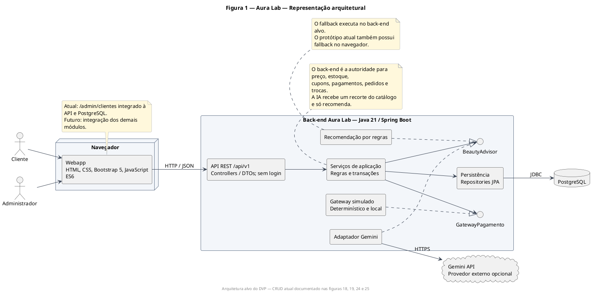
```plantuml
@startuml
footer Arquitetura alvo do DVP — CRUD atual documentado nas figuras 18, 19, 24 e 25
skinparam backgroundColor white
skinparam shadowing false
skinparam defaultFontName Arial
skinparam defaultFontSize 13
skinparam ArrowColor #374151
skinparam packageStyle rectangle
skinparam componentStyle rectangle
skinparam classAttributeIconSize 0
skinparam roundcorner 6
skinparam NoteBackgroundColor #FFF8DC
skinparam NoteBorderColor #9CA3AF
skinparam PackageBackgroundColor #F3F6FA
skinparam PackageBorderColor #64748B
skinparam ClassBackgroundColor #FFFFFF
skinparam ClassBorderColor #64748B
skinparam wrapWidth 220

title Figura 1 — Aura Lab — Representação arquitetural

left to right direction
actor Cliente
actor Administrador
node "Navegador" {
  component "Webapp\nHTML, CSS, Bootstrap 5, JavaScript ES6" as Web
}
rectangle "Back-end Aura Lab — Java 21 / Spring Boot" {
  component "API REST /api/v1\nControllers / DTOs; sem login" as API
  component "Serviços de aplicação\nRegras e transações" as Services
  component "Persistência\nRepositories JPA" as Persistence
  interface BeautyAdvisor
  component "Adaptador Gemini" as GeminiAdapter
  component "Recomendação por regras" as Rules
  interface GatewayPagamento
  component "Gateway simulado\nDeterminístico e local" as Payment
}
database PostgreSQL as DB
cloud "Gemini API\nProvedor externo opcional" as Gemini
Cliente --> Web
Administrador --> Web
Web --> API : HTTP / JSON
API --> Services
Services --> Persistence
Persistence --> DB : JDBC
Services --> BeautyAdvisor
GeminiAdapter ..|> BeautyAdvisor
Rules ..|> BeautyAdvisor
GeminiAdapter --> Gemini : HTTPS
Services --> GatewayPagamento
Payment ..|> GatewayPagamento
note bottom of Services
  O back-end é a autoridade para preço, estoque,
  cupons, pagamentos, pedidos e trocas.
  A IA recebe um recorte do catálogo e só recomenda.
end note
note bottom of Rules
  O fallback executa no back-end alvo.
  O protótipo atual também possui fallback no navegador.
end note

note bottom of Web
 Atual: /admin/clientes integrado à API e PostgreSQL.
 Futuro: integração dos demais módulos.
end note
@enduml
```

## Figura 2 — Aura Lab — Caso de uso Realizar Pedido
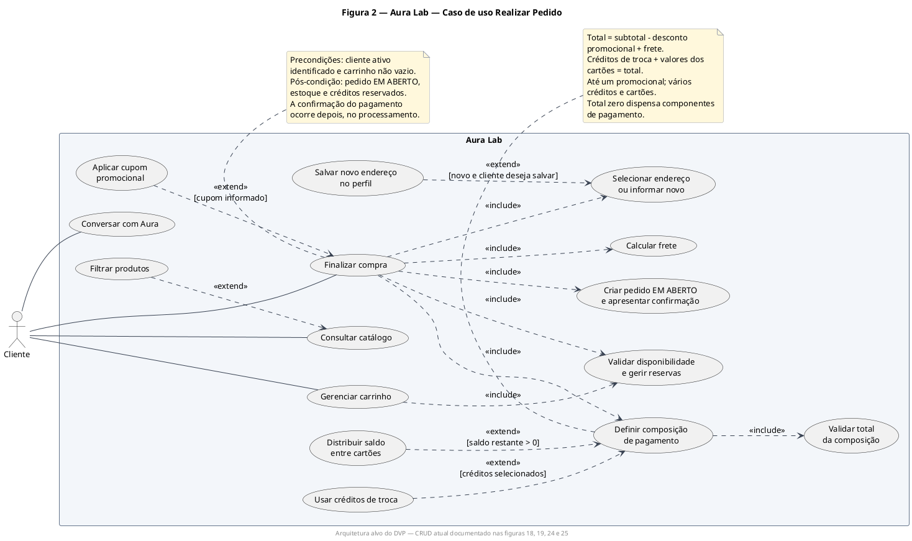
```plantuml
@startuml
footer Arquitetura alvo do DVP — CRUD atual documentado nas figuras 18, 19, 24 e 25
skinparam backgroundColor white
skinparam shadowing false
skinparam defaultFontName Arial
skinparam defaultFontSize 13
skinparam ArrowColor #374151
skinparam packageStyle rectangle
skinparam componentStyle rectangle
skinparam classAttributeIconSize 0
skinparam roundcorner 6
skinparam NoteBackgroundColor #FFF8DC
skinparam NoteBorderColor #9CA3AF
skinparam PackageBackgroundColor #F3F6FA
skinparam PackageBorderColor #64748B
skinparam ClassBackgroundColor #FFFFFF
skinparam ClassBorderColor #64748B
skinparam wrapWidth 220

title Figura 2 — Aura Lab — Caso de uso Realizar Pedido

left to right direction
actor Cliente
rectangle "Aura Lab" {
  usecase "Consultar catálogo" as Catalogo
  usecase "Filtrar produtos" as Filtro
  usecase "Conversar com Aura" as Aura
  usecase "Gerenciar carrinho" as Carrinho
  usecase "Validar disponibilidade\ne gerir reservas" as Reserva
  usecase "Finalizar compra" as Checkout
  usecase "Selecionar endereço\nou informar novo" as Endereco
  usecase "Salvar novo endereço\nno perfil" as SalvarEndereco
  usecase "Calcular frete" as Frete
  usecase "Aplicar cupom\npromocional" as Promo
  usecase "Definir composição\nde pagamento" as Composicao
  usecase "Usar créditos de troca" as Credito
  usecase "Distribuir saldo\nentre cartões" as Cartoes
  usecase "Validar total\nda composição" as Total
  usecase "Criar pedido EM ABERTO\ne apresentar confirmação" as Pedido
}
Cliente -- Catalogo
Cliente -- Aura
Cliente -- Carrinho
Cliente -- Checkout
Filtro ..> Catalogo : <<extend>>
Carrinho ..> Reserva : <<include>>
Checkout ..> Reserva : <<include>>
Checkout ..> Endereco : <<include>>
Checkout ..> Frete : <<include>>
Checkout ..> Composicao : <<include>>
Checkout ..> Pedido : <<include>>
Promo ..> Checkout : <<extend>>\n[cupom informado]
SalvarEndereco ..> Endereco : <<extend>>\n[novo e cliente deseja salvar]
Credito ..> Composicao : <<extend>>\n[créditos selecionados]
Cartoes ..> Composicao : <<extend>>\n[saldo restante > 0]
Composicao ..> Total : <<include>>
note bottom of Checkout
  Precondições: cliente ativo identificado e carrinho não vazio.
  Pós-condição: pedido EM ABERTO, estoque e créditos reservados.
  A confirmação do pagamento ocorre depois, no processamento.
end note
note bottom of Composicao
  Total = subtotal - desconto promocional + frete.
  Créditos de troca + valores dos cartões = total.
  Até um promocional; vários créditos e cartões.
  Total zero dispensa componentes de pagamento.
end note

@enduml
```

## Figura 3 — Aura Lab — Casos de uso de pedidos e trocas
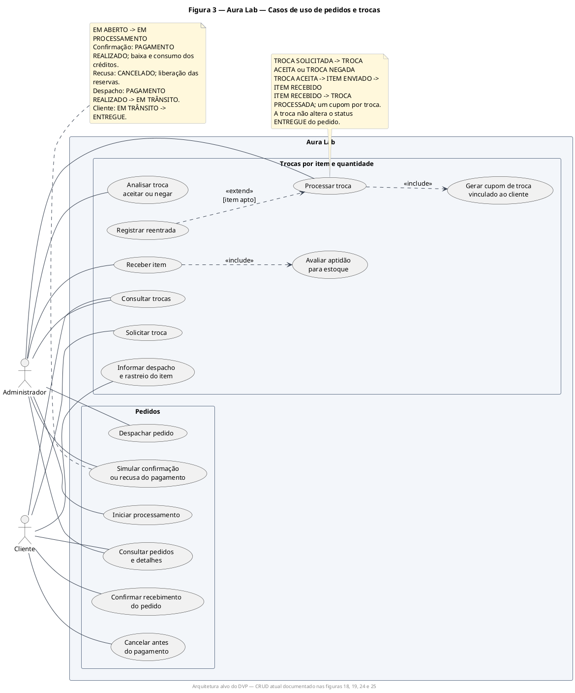
```plantuml
@startuml
footer Arquitetura alvo do DVP — CRUD atual documentado nas figuras 18, 19, 24 e 25
skinparam backgroundColor white
skinparam shadowing false
skinparam defaultFontName Arial
skinparam defaultFontSize 13
skinparam ArrowColor #374151
skinparam packageStyle rectangle
skinparam componentStyle rectangle
skinparam classAttributeIconSize 0
skinparam roundcorner 6
skinparam NoteBackgroundColor #FFF8DC
skinparam NoteBorderColor #9CA3AF
skinparam PackageBackgroundColor #F3F6FA
skinparam PackageBorderColor #64748B
skinparam ClassBackgroundColor #FFFFFF
skinparam ClassBorderColor #64748B
skinparam wrapWidth 220

title Figura 3 — Aura Lab — Casos de uso de pedidos e trocas

left to right direction
actor Cliente
actor Administrador as Admin
rectangle "Aura Lab" {
  package "Pedidos" {
    usecase "Consultar pedidos\ne detalhes" as Consultar
    usecase "Iniciar processamento" as Iniciar
    usecase "Simular confirmação\nou recusa do pagamento" as Pagar
    usecase "Despachar pedido" as Despachar
    usecase "Cancelar antes\ndo pagamento" as Cancelar
    usecase "Confirmar recebimento\ndo pedido" as Entregar
  }
  package "Trocas por item e quantidade" {
    usecase "Solicitar troca" as Solicitar
    usecase "Consultar trocas" as ConsultarTrocas
    usecase "Analisar troca\naceitar ou negar" as Analisar
    usecase "Informar despacho\ne rastreio do item" as Enviar
    usecase "Receber item" as Receber
    usecase "Avaliar aptidão\npara estoque" as Avaliar
    usecase "Registrar reentrada" as Reentrada
    usecase "Processar troca" as Processar
    usecase "Gerar cupom de troca\nvinculado ao cliente" as Cupom
  }
}
Admin -- Consultar
Admin -- Iniciar
Admin -- Pagar
Admin -- Despachar
Admin -- ConsultarTrocas
Admin -- Analisar
Admin -- Receber
Admin -- Processar
Cliente -- Consultar
Cliente -- Cancelar
Cliente -- Entregar
Cliente -- Solicitar
Cliente -- ConsultarTrocas
Cliente -- Enviar
Receber ..> Avaliar : <<include>>
Reentrada ..> Processar : <<extend>>\n[item apto]
Processar ..> Cupom : <<include>>
note bottom of Pagar
  EM ABERTO -> EM PROCESSAMENTO
  Confirmação: PAGAMENTO REALIZADO; baixa e consumo dos créditos.
  Recusa: CANCELADO; liberação das reservas.
  Despacho: PAGAMENTO REALIZADO -> EM TRÂNSITO.
  Cliente: EM TRÂNSITO -> ENTREGUE.
end note
note bottom of Processar
  TROCA SOLICITADA -> TROCA ACEITA ou TROCA NEGADA
  TROCA ACEITA -> ITEM ENVIADO -> ITEM RECEBIDO
  ITEM RECEBIDO -> TROCA PROCESSADA; um cupom por troca.
  A troca não altera o status ENTREGUE do pedido.
end note

@enduml
```

## Figura 4 — Aura Lab — Caso de uso Gerenciar Produtos
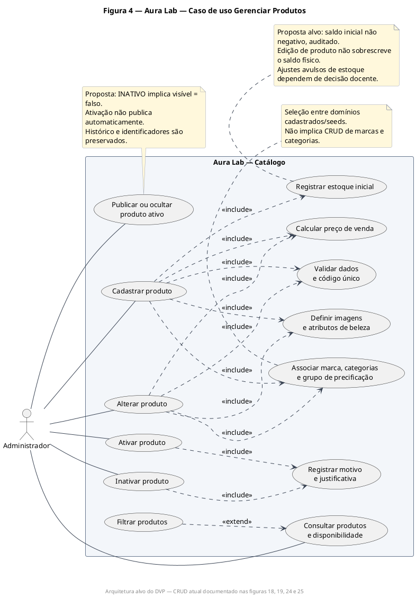
```plantuml
@startuml
footer Arquitetura alvo do DVP — CRUD atual documentado nas figuras 18, 19, 24 e 25
skinparam backgroundColor white
skinparam shadowing false
skinparam defaultFontName Arial
skinparam defaultFontSize 13
skinparam ArrowColor #374151
skinparam packageStyle rectangle
skinparam componentStyle rectangle
skinparam classAttributeIconSize 0
skinparam roundcorner 6
skinparam NoteBackgroundColor #FFF8DC
skinparam NoteBorderColor #9CA3AF
skinparam PackageBackgroundColor #F3F6FA
skinparam PackageBorderColor #64748B
skinparam ClassBackgroundColor #FFFFFF
skinparam ClassBorderColor #64748B
skinparam wrapWidth 220

title Figura 4 — Aura Lab — Caso de uso Gerenciar Produtos

left to right direction
actor Administrador as Admin
rectangle "Aura Lab — Catálogo" {
  usecase "Consultar produtos\ne disponibilidade" as Consultar
  usecase "Filtrar produtos" as Filtrar
  usecase "Cadastrar produto" as Cadastrar
  usecase "Alterar produto" as Alterar
  usecase "Validar dados\ne código único" as Validar
  usecase "Associar marca, categorias\ne grupo de precificação" as Associar
  usecase "Calcular preço de venda" as Preco
  usecase "Definir imagens\ne atributos de beleza" as Imagens
  usecase "Registrar estoque inicial" as Inicial
  usecase "Ativar produto" as Ativar
  usecase "Inativar produto" as Inativar
  usecase "Registrar motivo\ne justificativa" as Motivo
  usecase "Publicar ou ocultar\nproduto ativo" as Visibilidade
}
Admin -- Consultar
Admin -- Cadastrar
Admin -- Alterar
Admin -- Ativar
Admin -- Inativar
Admin -- Visibilidade
Filtrar ..> Consultar : <<extend>>
Cadastrar ..> Validar : <<include>>
Alterar ..> Validar : <<include>>
Cadastrar ..> Associar : <<include>>
Alterar ..> Associar : <<include>>
Cadastrar ..> Preco : <<include>>
Alterar ..> Preco : <<include>>
Cadastrar ..> Imagens : <<include>>
Alterar ..> Imagens : <<include>>
Cadastrar ..> Inicial : <<include>>
Ativar ..> Motivo : <<include>>
Inativar ..> Motivo : <<include>>
note bottom of Associar
  Seleção entre domínios cadastrados/seeds.
  Não implica CRUD de marcas e categorias.
end note
note bottom of Visibilidade
  Proposta: INATIVO implica visível = falso.
  Ativação não publica automaticamente.
  Histórico e identificadores são preservados.
end note
note bottom of Inicial
  Proposta alvo: saldo inicial não negativo, auditado.
  Edição de produto não sobrescreve o saldo físico.
  Ajustes avulsos de estoque dependem de decisão docente.
end note

@enduml
```

## Figura 5 — Pacotes e dependências permitidas
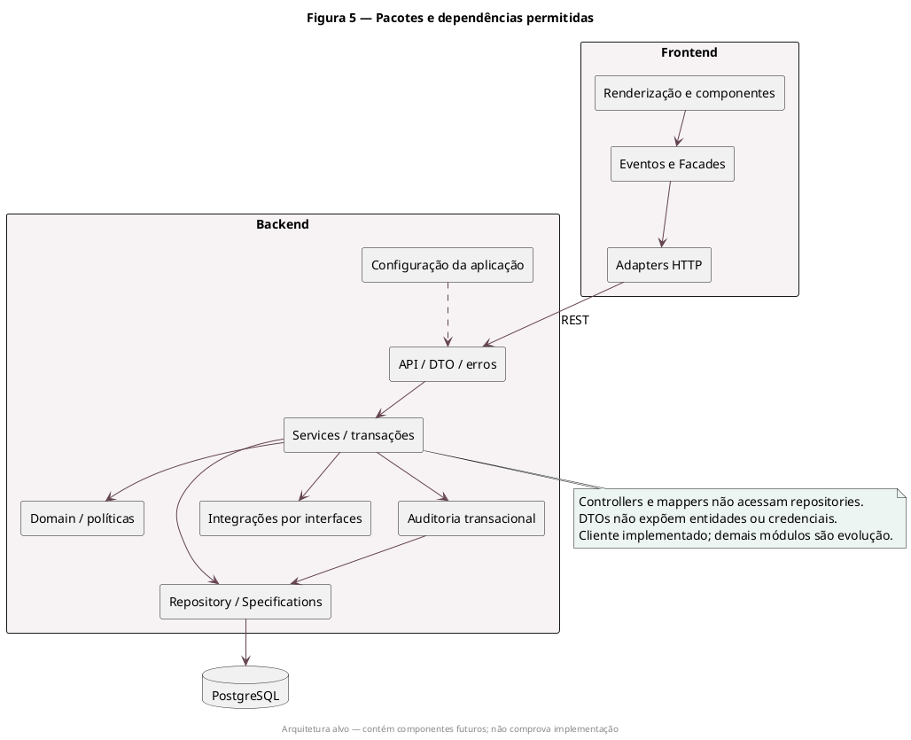
```plantuml
@startuml
skinparam backgroundColor white
skinparam shadowing false
skinparam defaultFontName Arial
skinparam defaultFontSize 14
skinparam classAttributeIconSize 0
skinparam packageStyle rectangle
skinparam componentStyle rectangle
skinparam ArrowColor #63424F
skinparam ClassBackgroundColor #FFF8E6
skinparam PackageBackgroundColor #F7F3F5
skinparam NoteBackgroundColor #EDF5F2
skinparam nodesep 30
skinparam ranksep 40
hide empty members
title Figura 5 — Pacotes e dependências permitidas
footer Arquitetura alvo — contém componentes futuros; não comprova implementação
package "Frontend" {
 [Renderização e componentes] as UI
 [Eventos e Facades] as Facade
 [Adapters HTTP] as HTTP
}
package "Backend" {
 [Configuração da aplicação] as Config
 [API / DTO / erros] as API
 [Services / transações] as Service
 [Domain / políticas] as Domain
 [Repository / Specifications] as Repo
 [Integrações por interfaces] as Integration
 [Auditoria transacional] as Audit
}
database PostgreSQL as DB
UI --> Facade
Facade --> HTTP
HTTP --> API : REST
Config ..> API
API --> Service
Service --> Domain
Service --> Repo
Service --> Integration
Service --> Audit
Audit --> Repo
Repo --> DB
note bottom of Service
 Controllers e mappers não acessam repositories.
 DTOs não expõem entidades ou credenciais.
 Cliente implementado; demais módulos são evolução.
end note
@enduml
```

## Figura 6 — Tecnologias e padrões
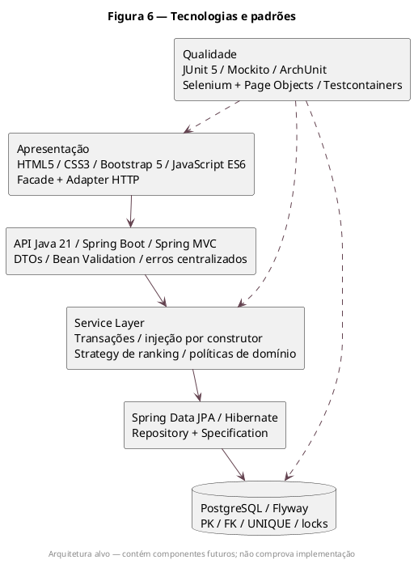
```plantuml
@startuml
skinparam backgroundColor white
skinparam shadowing false
skinparam defaultFontName Arial
skinparam defaultFontSize 14
skinparam classAttributeIconSize 0
skinparam packageStyle rectangle
skinparam componentStyle rectangle
skinparam ArrowColor #63424F
skinparam ClassBackgroundColor #FFF8E6
skinparam PackageBackgroundColor #F7F3F5
skinparam NoteBackgroundColor #EDF5F2
skinparam nodesep 30
skinparam ranksep 40
hide empty members
title Figura 6 — Tecnologias e padrões
footer Arquitetura alvo — contém componentes futuros; não comprova implementação
rectangle "Apresentação\nHTML5 / CSS3 / Bootstrap 5 / JavaScript ES6\nFacade + Adapter HTTP" as UI
rectangle "API Java 21 / Spring Boot / Spring MVC\nDTOs / Bean Validation / erros centralizados" as API
rectangle "Service Layer\nTransações / injeção por construtor\nStrategy de ranking / políticas de domínio" as S
rectangle "Spring Data JPA / Hibernate\nRepository + Specification" as R
database "PostgreSQL / Flyway\nPK / FK / UNIQUE / locks" as DB
rectangle "Qualidade\nJUnit 5 / Mockito / ArchUnit\nSelenium + Page Objects / Testcontainers" as Tests
UI --> API
API --> S
S --> R
R --> DB
Tests ..> UI
Tests ..> S
Tests ..> DB
@enduml
```

## Figura 7 — Apresentação atual e evolução
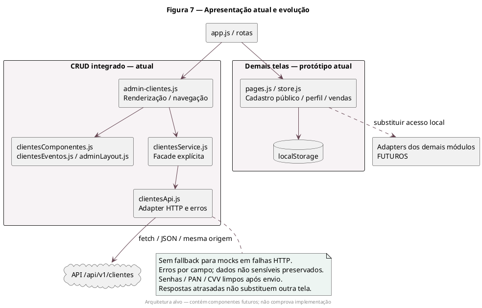
```plantuml
@startuml
skinparam backgroundColor white
skinparam shadowing false
skinparam defaultFontName Arial
skinparam defaultFontSize 14
skinparam classAttributeIconSize 0
skinparam packageStyle rectangle
skinparam componentStyle rectangle
skinparam ArrowColor #63424F
skinparam ClassBackgroundColor #FFF8E6
skinparam PackageBackgroundColor #F7F3F5
skinparam NoteBackgroundColor #EDF5F2
skinparam nodesep 30
skinparam ranksep 40
hide empty members
title Figura 7 — Apresentação atual e evolução
footer Arquitetura alvo — contém componentes futuros; não comprova implementação
component "app.js / rotas" as App
package "CRUD integrado — atual" {
 [admin-clientes.js\nRenderização / navegação] as Admin
 [clientesComponentes.js\nclientesEventos.js / adminLayout.js] as Components
 [clientesService.js\nFacade explícita] as Facade
 [clientesApi.js\nAdapter HTTP e erros] as HTTP
}
package "Demais telas — protótipo atual" {
 [pages.js / store.js\nCadastro público / perfil / vendas] as Mock
 database localStorage as Local
}
cloud "API /api/v1/clientes" as API
component "Adapters dos demais módulos\nFUTUROS" as Future
App --> Admin
Admin --> Components
Admin --> Facade
Facade --> HTTP
HTTP --> API : fetch / JSON / mesma origem
App --> Mock
Mock --> Local
Mock ..> Future : substituir acesso local
note bottom of HTTP
 Sem fallback para mocks em falhas HTTP.
 Erros por campo; dados não sensíveis preservados.
 Senhas / PAN / CVV limpos após envio.
 Respostas atrasadas não substituem outra tela.
end note
@enduml
```

## Figura 8 — Negócio, políticas e integrações
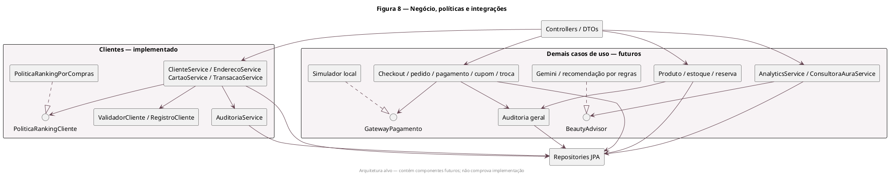
```plantuml
@startuml
skinparam backgroundColor white
skinparam shadowing false
skinparam defaultFontName Arial
skinparam defaultFontSize 14
skinparam classAttributeIconSize 0
skinparam packageStyle rectangle
skinparam componentStyle rectangle
skinparam ArrowColor #63424F
skinparam ClassBackgroundColor #FFF8E6
skinparam PackageBackgroundColor #F7F3F5
skinparam NoteBackgroundColor #EDF5F2
skinparam nodesep 30
skinparam ranksep 40
hide empty members
title Figura 8 — Negócio, políticas e integrações
footer Arquitetura alvo — contém componentes futuros; não comprova implementação
component "Controllers / DTOs" as API
package "Clientes — implementado" {
 [ClienteService / EnderecoService\nCartaoService / TransacaoService] as Cliente
 interface PoliticaRankingCliente as Ranking
 [PoliticaRankingPorCompras] as Formula
 [ValidadorCliente / RegistroCliente] as Policy
 [AuditoriaService] as Audit
}
package "Demais casos de uso — futuros" {
 [Produto / estoque / reserva] as Catalogo
 [Checkout / pedido / pagamento / cupom / troca] as Venda
 [AnalyticsService / ConsultoraAuraService] as Consulta
 interface BeautyAdvisor
 interface GatewayPagamento
 [Gemini / recomendação por regras] as AI
 [Simulador local] as Pay
 [Auditoria geral] as AuditFuture
}
component "Repositories JPA" as Repo
API --> Cliente
Cliente --> Policy
Cliente --> Ranking
Formula ..|> Ranking
Cliente --> Audit
Audit --> Repo
Cliente --> Repo
API --> Catalogo
API --> Venda
API --> Consulta
Venda --> GatewayPagamento
Pay ..|> GatewayPagamento
Consulta --> BeautyAdvisor
AI ..|> BeautyAdvisor
Catalogo --> Repo
Venda --> Repo
Consulta --> Repo
Venda --> AuditFuture
Catalogo --> AuditFuture
AuditFuture --> Repo
@enduml
```

## Figura 9 — Controllers, Services e colaborações
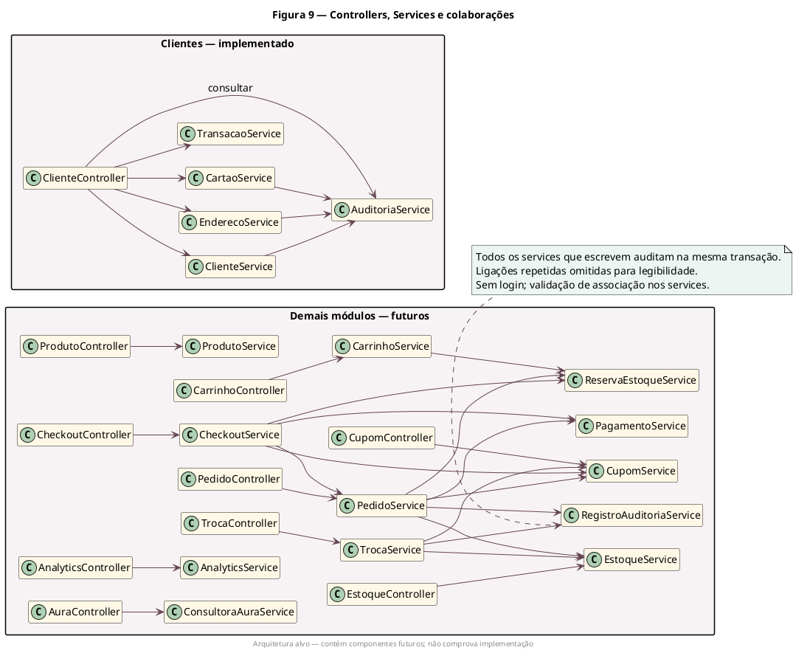
```plantuml
@startuml
skinparam backgroundColor white
skinparam shadowing false
skinparam defaultFontName Arial
skinparam defaultFontSize 14
skinparam classAttributeIconSize 0
skinparam packageStyle rectangle
skinparam componentStyle rectangle
skinparam ArrowColor #63424F
skinparam ClassBackgroundColor #FFF8E6
skinparam PackageBackgroundColor #F7F3F5
skinparam NoteBackgroundColor #EDF5F2
skinparam nodesep 30
skinparam ranksep 40
hide empty members
title Figura 9 — Controllers, Services e colaborações
footer Arquitetura alvo — contém componentes futuros; não comprova implementação
left to right direction
package "Clientes — implementado" {
 class ClienteController
 class ClienteService
 class EnderecoService
 class CartaoService
 class TransacaoService
 class AuditoriaService
 ClienteController --> ClienteService
 ClienteController --> EnderecoService
 ClienteController --> CartaoService
 ClienteController --> TransacaoService
 ClienteController --> AuditoriaService : consultar
 ClienteService --> AuditoriaService
 EnderecoService --> AuditoriaService
 CartaoService --> AuditoriaService
}
package "Demais módulos — futuros" {
 class ProdutoController
 class ProdutoService
 class CarrinhoController
 class CarrinhoService
 class CheckoutController
 class CheckoutService
 class PedidoController
 class PedidoService
 class TrocaController
 class TrocaService
 class CupomController
 class CupomService
 class EstoqueController
 class EstoqueService
 class ReservaEstoqueService
 class PagamentoService
 class AnalyticsController
 class AnalyticsService
 class AuraController
 class ConsultoraAuraService
 class RegistroAuditoriaService
 ProdutoController --> ProdutoService
 CarrinhoController --> CarrinhoService
 CheckoutController --> CheckoutService
 PedidoController --> PedidoService
 TrocaController --> TrocaService
 CupomController --> CupomService
 EstoqueController --> EstoqueService
 AnalyticsController --> AnalyticsService
 AuraController --> ConsultoraAuraService
 CarrinhoService --> ReservaEstoqueService
 CheckoutService --> PedidoService
 CheckoutService --> PagamentoService
 CheckoutService --> CupomService
 CheckoutService --> ReservaEstoqueService
 PedidoService --> PagamentoService
 PedidoService --> ReservaEstoqueService
 PedidoService --> EstoqueService
 PedidoService --> CupomService
 TrocaService --> EstoqueService
 TrocaService --> CupomService
 PedidoService --> RegistroAuditoriaService
 TrocaService --> RegistroAuditoriaService
}
note bottom of RegistroAuditoriaService
 Todos os services que escrevem auditam na mesma transação.
 Ligações repetidas omitidas para legibilidade.
 Sem login; validação de associação nos services.
end note
@enduml
```

## Aura Lab — Modelo de domínio
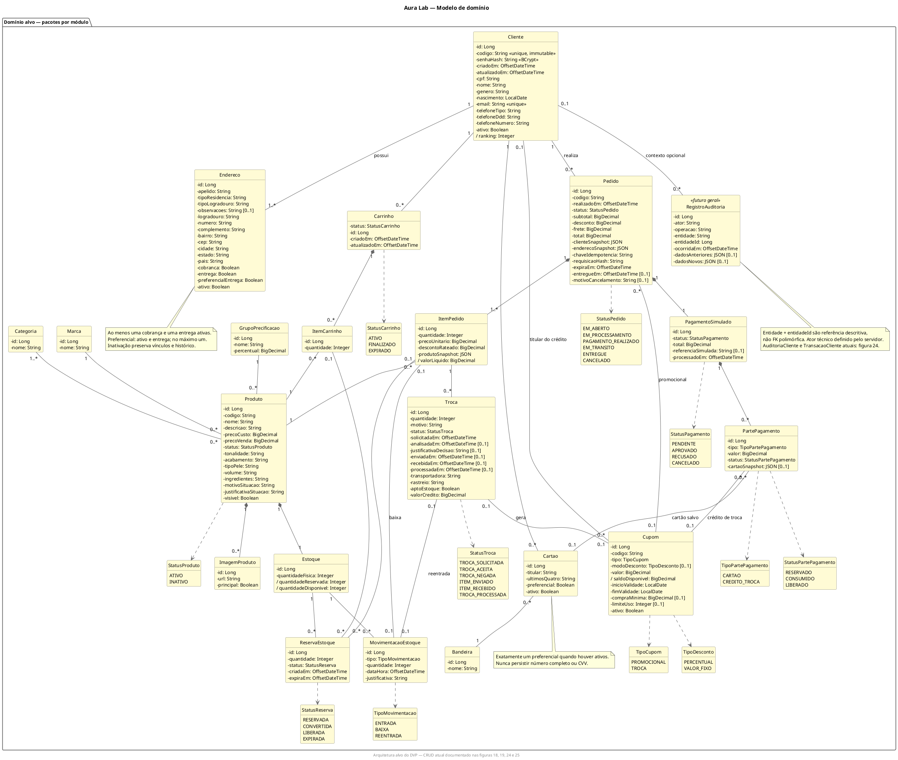
```plantuml
@startuml
footer Arquitetura alvo do DVP — CRUD atual documentado nas figuras 18, 19, 24 e 25
set namespaceSeparator none
' Visão conceitual proposta para a solução completa.
title Aura Lab — Modelo de domínio
skinparam backgroundColor white
skinparam shadowing false
skinparam defaultFontName Arial
skinparam defaultFontSize 12
skinparam classAttributeIconSize 0
skinparam classBackgroundColor #FFFBD5
skinparam classBorderColor #777766
skinparam packageBackgroundColor white
skinparam packageBorderColor #555555
skinparam ArrowColor #666666
skinparam nodesep 35
skinparam ranksep 55
hide circle
hide empty methods

package "Domínio alvo — pacotes por módulo" {
class Cliente {
  - id: Long
  - codigo: String <<unique, immutable>>
  - senhaHash: String <<BCrypt>>
  - criadoEm: OffsetDateTime
  - atualizadoEm: OffsetDateTime
  - cpf: String
  - nome: String
  - genero: String
  - nascimento: LocalDate
  - email: String <<unique>>
  - telefoneTipo: String
  - telefoneDdd: String
  - telefoneNumero: String
  - ativo: Boolean
  / ranking: Integer
}
class Endereco {
  - id: Long
  - apelido: String
  - tipoResidencia: String
  - tipoLogradouro: String
  - observacoes: String [0..1]
  - logradouro: String
  - numero: String
  - complemento: String
  - bairro: String
  - cep: String
  - cidade: String
  - estado: String
  - pais: String
  - cobranca: Boolean
  - entrega: Boolean
  - preferencialEntrega: Boolean
  - ativo: Boolean
}
class Cartao {
  - id: Long
  - titular: String
  - ultimosQuatro: String
  - preferencial: Boolean
  - ativo: Boolean
}
class Bandeira {
  - id: Long
  - nome: String
}
class Carrinho {
  - status: StatusCarrinho
  - id: Long
  - criadoEm: OffsetDateTime
  - atualizadoEm: OffsetDateTime
}
class ItemCarrinho {
  - id: Long
  - quantidade: Integer
}
class Produto {
  - id: Long
  - codigo: String
  - nome: String
  - descricao: String
  - precoCusto: BigDecimal
  - precoVenda: BigDecimal
  - status: StatusProduto
  - tonalidade: String
  - acabamento: String
  - tipoPele: String
  - volume: String
  - ingredientes: String
  - motivoSituacao: String
  - justificativaSituacao: String
  - visivel: Boolean
}
class Marca {
  - id: Long
  - nome: String
}
class Categoria {
  - id: Long
  - nome: String
}
class GrupoPrecificacao {
  - id: Long
  - nome: String
  - percentual: BigDecimal
}
class ImagemProduto {
  - id: Long
  - url: String
  - principal: Boolean
}
class Estoque {
  - id: Long
  - quantidadeFisica: Integer
  / quantidadeReservada: Integer
  / quantidadeDisponivel: Integer
}
class ReservaEstoque {
  - id: Long
  - quantidade: Integer
  - status: StatusReserva
  - criadaEm: OffsetDateTime
  - expiraEm: OffsetDateTime
}
class MovimentacaoEstoque {
  - id: Long
  - tipo: TipoMovimentacao
  - quantidade: Integer
  - dataHora: OffsetDateTime
  - justificativa: String
}
class Pedido {
  - id: Long
  - codigo: String
  - realizadoEm: OffsetDateTime
  - status: StatusPedido
  - subtotal: BigDecimal
  - desconto: BigDecimal
  - frete: BigDecimal
  - total: BigDecimal
  - clienteSnapshot: JSON
  - enderecoSnapshot: JSON
  - chaveIdempotencia: String
  - requisicaoHash: String
  - expiraEm: OffsetDateTime
  - entregueEm: OffsetDateTime [0..1]
  - motivoCancelamento: String [0..1]
}
class ItemPedido {
  - id: Long
  - quantidade: Integer
  - precoUnitario: BigDecimal
  - descontoRateado: BigDecimal
  - produtoSnapshot: JSON
  / valorLiquido: BigDecimal
}
class PagamentoSimulado {
  - id: Long
  - status: StatusPagamento
  - total: BigDecimal
  - referenciaSimulada: String [0..1]
  - processadoEm: OffsetDateTime
}
class PartePagamento {
  - id: Long
  - tipo: TipoPartePagamento
  - valor: BigDecimal
  - status: StatusPartePagamento
  - cartaoSnapshot: JSON [0..1]
}
class Cupom {
  - id: Long
  - codigo: String
  - tipo: TipoCupom
  - modoDesconto: TipoDesconto [0..1]
  - valor: BigDecimal
  / saldoDisponivel: BigDecimal
  - inicioValidade: LocalDate
  - fimValidade: LocalDate
  - compraMinima: BigDecimal [0..1]
  - limiteUso: Integer [0..1]
  - ativo: Boolean
}
class Troca {
  - id: Long
  - quantidade: Integer
  - motivo: String
  - status: StatusTroca
  - solicitadaEm: OffsetDateTime
  - analisadaEm: OffsetDateTime [0..1]
  - justificativaDecisao: String [0..1]
  - enviadaEm: OffsetDateTime [0..1]
  - recebidaEm: OffsetDateTime [0..1]
  - processadaEm: OffsetDateTime [0..1]
  - transportadora: String
  - rastreio: String
  - aptoEstoque: Boolean
  - valorCredito: BigDecimal
}


enum StatusCarrinho {
 ATIVO
 FINALIZADO
 EXPIRADO
}
class RegistroAuditoria <<futuro geral>> {
 - id: Long
 - ator: String
 - operacao: String
 - entidade: String
 - entidadeId: Long
 - ocorridaEm: OffsetDateTime
 - dadosAnteriores: JSON [0..1]
 - dadosNovos: JSON [0..1]
}
Carrinho ..> StatusCarrinho
Cliente "0..1" -- "0..*" RegistroAuditoria : contexto opcional

note bottom of RegistroAuditoria
 Entidade + entidadeId são referência descritiva,
 não FK polimórfica. Ator técnico definido pelo servidor.
 AuditoriaCliente e TransacaoCliente atuais: figura 24.
end note
note bottom of Endereco
 Ao menos uma cobrança e uma entrega ativas.
 Preferencial: ativo e entrega; no máximo um.
 Inativação preserva vínculos e histórico.
end note
note bottom of Cartao
 Exatamente um preferencial quando houver ativos.
 Nunca persistir número completo ou CVV.
end note

enum StatusProduto {
  ATIVO
  INATIVO
}
enum StatusReserva {
  RESERVADA
  CONVERTIDA
  LIBERADA
  EXPIRADA
}
enum TipoMovimentacao {
  ENTRADA
  BAIXA
  REENTRADA
}
enum StatusPedido {
  EM_ABERTO
  EM_PROCESSAMENTO
  PAGAMENTO_REALIZADO
  EM_TRANSITO
  ENTREGUE
  CANCELADO
}
enum StatusPagamento {
  PENDENTE
  APROVADO
  RECUSADO
  CANCELADO
}
enum TipoPartePagamento {
  CARTAO
  CREDITO_TROCA
}
enum StatusPartePagamento {
  RESERVADO
  CONSUMIDO
  LIBERADO
}
enum TipoCupom {
  PROMOCIONAL
  TROCA
}
enum TipoDesconto {
  PERCENTUAL
  VALOR_FIXO
}
enum StatusTroca {
  TROCA_SOLICITADA
  TROCA_ACEITA
  TROCA_NEGADA
  ITEM_ENVIADO
  ITEM_RECEBIDO
  TROCA_PROCESSADA
}

Cliente "1" -- "1..*" Endereco : possui
Cliente "1" -- "0..*" Cartao
Cartao "0..*" -- "1" Bandeira
Cliente "1" -- "0..*" Carrinho
Cliente "1" -- "0..*" Pedido : realiza
Carrinho "1" *-- "0..*" ItemCarrinho
ItemCarrinho "0..*" -- "1" Produto
GrupoPrecificacao "1" -- "0..*" Produto
Categoria "1..*" -- "0..*" Produto
Marca "1" -- "0..*" Produto
Produto "1" *-- "0..*" ImagemProduto
Produto "1" *-- "1" Estoque
Estoque "1" -- "0..*" ReservaEstoque
Estoque "1" -- "0..*" MovimentacaoEstoque
ItemCarrinho "0..1" -- "0..*" ReservaEstoque
ItemPedido "0..1" -- "0..*" ReservaEstoque
Pedido "1" *-- "1..*" ItemPedido
ItemPedido "0..*" -- "1" Produto
Pedido "1" *-- "1" PagamentoSimulado
PagamentoSimulado "1" *-- "0..*" PartePagamento
PartePagamento "0..*" -- "0..1" Cartao : cartão salvo
PartePagamento "0..*" -- "0..1" Cupom : crédito de troca
Pedido "0..*" -- "0..1" Cupom : promocional
Cliente "0..1" -- "0..*" Cupom : titular do crédito
ItemPedido "1" -- "0..*" Troca
Troca "0..1" -- "0..1" Cupom : gera
Troca "0..1" -- "0..1" MovimentacaoEstoque : reentrada
ItemPedido "0..1" -- "0..1" MovimentacaoEstoque : baixa

Produto ..> StatusProduto
ReservaEstoque ..> StatusReserva
MovimentacaoEstoque ..> TipoMovimentacao
Pedido ..> StatusPedido
PagamentoSimulado ..> StatusPagamento
PartePagamento ..> TipoPartePagamento
PartePagamento ..> StatusPartePagamento
Cupom ..> TipoCupom
Cupom ..> TipoDesconto
Troca ..> StatusTroca
}
@enduml

```

## Figura 11 — Aura Lab — Camada de persistência
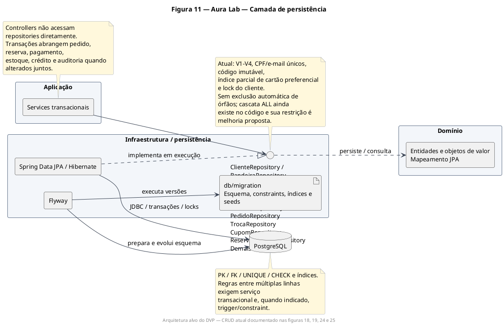
```plantuml
@startuml
footer Arquitetura alvo do DVP — CRUD atual documentado nas figuras 18, 19, 24 e 25
skinparam backgroundColor white
skinparam shadowing false
skinparam defaultFontName Arial
skinparam defaultFontSize 13
skinparam ArrowColor #374151
skinparam packageStyle rectangle
skinparam componentStyle rectangle
skinparam classAttributeIconSize 0
skinparam roundcorner 6
skinparam NoteBackgroundColor #FFF8DC
skinparam NoteBorderColor #9CA3AF
skinparam PackageBackgroundColor #F3F6FA
skinparam PackageBorderColor #64748B
skinparam ClassBackgroundColor #FFFFFF
skinparam ClassBorderColor #64748B
skinparam wrapWidth 220

title Figura 11 — Aura Lab — Camada de persistência

left to right direction
package "Aplicação" {
  [Services transacionais] as Services
}
package "Domínio" {
  [Entidades e objetos de valor\nMapeamento JPA] as Entities
}
package "Infraestrutura / persistência" {
  interface "ClienteRepository / BandeiraRepository\nTransacaoRepository / AuditoriaRepository\nDemais repositories futuros: ProdutoRepository\nPedidoRepository\nTrocaRepository\nCupomRepository\nReservaEstoqueRepository\nDemais repositories" as Repos
  component "Spring Data JPA / Hibernate" as JPA
  artifact "db/migration\nEsquema, constraints, índices e seeds" as Migrations
  component Flyway
}
database PostgreSQL as DB
Services --> Repos
Repos ..> Entities : persiste / consulta
JPA ..|> Repos : implementa em execução
JPA --> DB : JDBC / transações / locks
Flyway --> Migrations : executa versões
Flyway --> DB : prepara e evolui esquema
note bottom of Services
  Controllers não acessam repositories diretamente.
  Transações abrangem pedido, reserva, pagamento,
  estoque, crédito e auditoria quando alterados juntos.
end note
note bottom of DB
  PK / FK / UNIQUE / CHECK e índices.
  Regras entre múltiplas linhas exigem serviço
  transacional e, quando indicado, trigger/constraint.
end note

note top of Repos
 Atual: V1–V4, CPF/e-mail únicos, código imutável,
 índice parcial de cartão preferencial e lock do cliente.
 Sem exclusão automática de órfãos; cascata ALL ainda
 existe no código e sua restrição é melhoria proposta.
end note
@enduml
```

## Figura 12 — Aura Lab — Sequência de finalização da compra
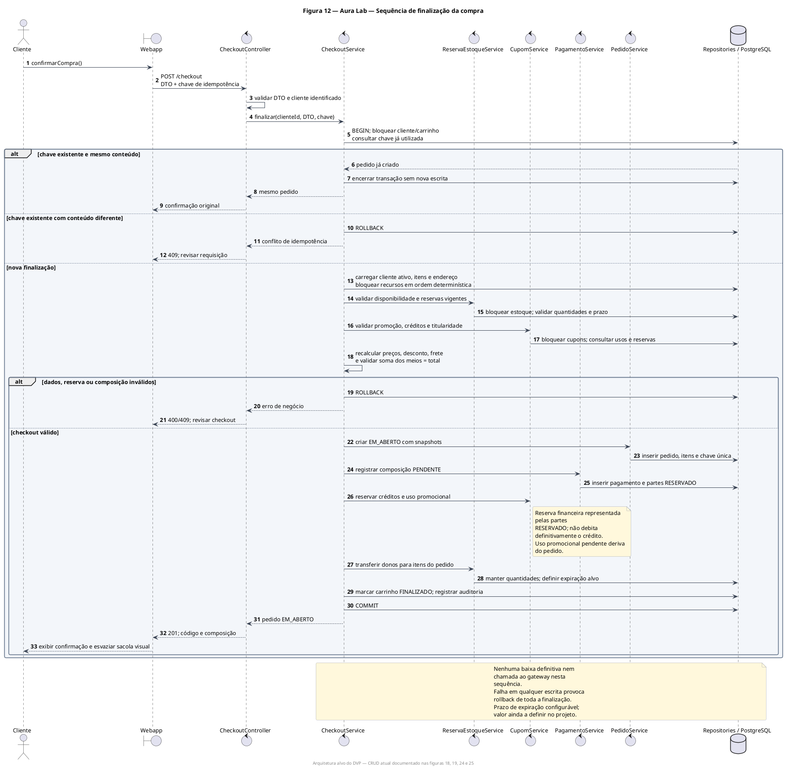
```plantuml
@startuml
footer Arquitetura alvo do DVP — CRUD atual documentado nas figuras 18, 19, 24 e 25
skinparam backgroundColor white
skinparam shadowing false
skinparam defaultFontName Arial
skinparam defaultFontSize 13
skinparam ArrowColor #374151
skinparam packageStyle rectangle
skinparam componentStyle rectangle
skinparam classAttributeIconSize 0
skinparam roundcorner 6
skinparam NoteBackgroundColor #FFF8DC
skinparam NoteBorderColor #9CA3AF
skinparam PackageBackgroundColor #F3F6FA
skinparam PackageBorderColor #64748B
skinparam ClassBackgroundColor #FFFFFF
skinparam ClassBorderColor #64748B
skinparam wrapWidth 220

title Figura 12 — Aura Lab — Sequência de finalização da compra

autonumber
actor Cliente
boundary Webapp
control CheckoutController as API
control CheckoutService as Checkout
control ReservaEstoqueService as Reserva
control CupomService as Cupom
control PagamentoService as Pagamento
control PedidoService as Pedido
database "Repositories / PostgreSQL" as DB
Cliente -> Webapp : confirmarCompra()
Webapp -> API : POST /checkout\nDTO + chave de idempotência
API -> API : validar DTO e cliente identificado
API -> Checkout : finalizar(clienteId, DTO, chave)
Checkout -> DB : BEGIN; bloquear cliente/carrinho\nconsultar chave já utilizada
alt chave existente e mesmo conteúdo
  DB --> Checkout : pedido já criado
  Checkout -> DB : encerrar transação sem nova escrita
  Checkout --> API : mesmo pedido
  API --> Webapp : confirmação original
else chave existente com conteúdo diferente
  Checkout -> DB : ROLLBACK
  Checkout --> API : conflito de idempotência
  API --> Webapp : 409; revisar requisição
else nova finalização
  Checkout -> DB : carregar cliente ativo, itens e endereço\nbloquear recursos em ordem determinística
  Checkout -> Reserva : validar disponibilidade e reservas vigentes
  Reserva -> DB : bloquear estoque; validar quantidades e prazo
  Checkout -> Cupom : validar promoção, créditos e titularidade
  Cupom -> DB : bloquear cupons; consultar usos e reservas
  Checkout -> Checkout : recalcular preços, desconto, frete\ne validar soma dos meios = total
  alt dados, reserva ou composição inválidos
    Checkout -> DB : ROLLBACK
    Checkout --> API : erro de negócio
    API --> Webapp : 400/409; revisar checkout
  else checkout válido
    Checkout -> Pedido : criar EM_ABERTO com snapshots
    Pedido -> DB : inserir pedido, itens e chave única
    Checkout -> Pagamento : registrar composição PENDENTE
    Pagamento -> DB : inserir pagamento e partes RESERVADO
    Checkout -> Cupom : reservar créditos e uso promocional
    note right of Cupom
      Reserva financeira representada pelas partes
      RESERVADO; não debita definitivamente o crédito.
      Uso promocional pendente deriva do pedido.
    end note
    Checkout -> Reserva : transferir donos para itens do pedido
    Reserva -> DB : manter quantidades; definir expiração alvo
    Checkout -> DB : marcar carrinho FINALIZADO; registrar auditoria
    Checkout -> DB : COMMIT
    Checkout --> API : pedido EM_ABERTO
    API --> Webapp : 201; código e composição
    Webapp --> Cliente : exibir confirmação e esvaziar sacola visual
  end
end
note over Checkout, DB
  Nenhuma baixa definitiva nem chamada ao gateway nesta sequência.
  Falha em qualquer escrita provoca rollback de toda a finalização.
  Prazo de expiração configurável; valor ainda a definir no projeto.
end note

@enduml
```

## Figura 13 — Aura Lab — Sequência de gerenciamento administrativo do pedido
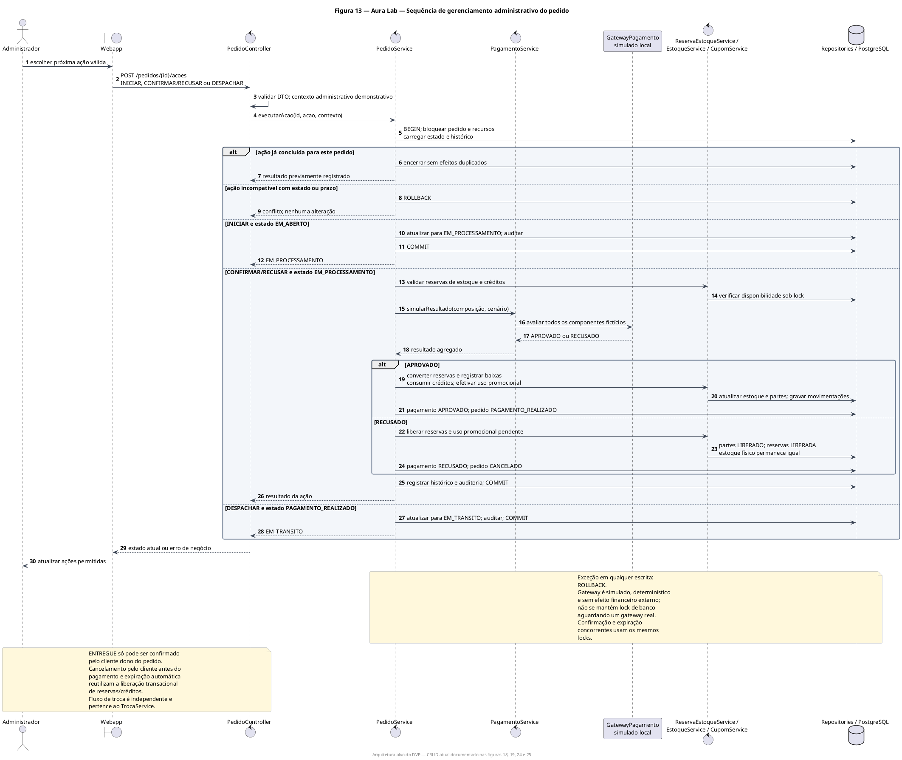
```plantuml
@startuml
footer Arquitetura alvo do DVP — CRUD atual documentado nas figuras 18, 19, 24 e 25
skinparam backgroundColor white
skinparam shadowing false
skinparam defaultFontName Arial
skinparam defaultFontSize 13
skinparam ArrowColor #374151
skinparam packageStyle rectangle
skinparam componentStyle rectangle
skinparam classAttributeIconSize 0
skinparam roundcorner 6
skinparam NoteBackgroundColor #FFF8DC
skinparam NoteBorderColor #9CA3AF
skinparam PackageBackgroundColor #F3F6FA
skinparam PackageBorderColor #64748B
skinparam ClassBackgroundColor #FFFFFF
skinparam ClassBorderColor #64748B
skinparam wrapWidth 220

title Figura 13 — Aura Lab — Sequência de gerenciamento administrativo do pedido

autonumber
actor Administrador as Admin
boundary Webapp
control PedidoController as API
control PedidoService as Pedido
control PagamentoService as Pagamento
participant "GatewayPagamento\nsimulado local" as Gateway
control "ReservaEstoqueService /\nEstoqueService / CupomService" as Recursos
database "Repositories / PostgreSQL" as DB
Admin -> Webapp : escolher próxima ação válida
Webapp -> API : POST /pedidos/{id}/acoes\nINICIAR, CONFIRMAR/RECUSAR ou DESPACHAR
API -> API : validar DTO; contexto administrativo demonstrativo
API -> Pedido : executarAcao(id, acao, contexto)
Pedido -> DB : BEGIN; bloquear pedido e recursos\ncarregar estado e histórico
alt ação já concluída para este pedido
  Pedido -> DB : encerrar sem efeitos duplicados
  Pedido --> API : resultado previamente registrado
else ação incompatível com estado ou prazo
  Pedido -> DB : ROLLBACK
  Pedido --> API : conflito; nenhuma alteração
else INICIAR e estado EM_ABERTO
  Pedido -> DB : atualizar para EM_PROCESSAMENTO; auditar
  Pedido -> DB : COMMIT
  Pedido --> API : EM_PROCESSAMENTO
else CONFIRMAR/RECUSAR e estado EM_PROCESSAMENTO
  Pedido -> Recursos : validar reservas de estoque e créditos
  Recursos -> DB : verificar disponibilidade sob lock
  Pedido -> Pagamento : simularResultado(composição, cenário)
  Pagamento -> Gateway : avaliar todos os componentes fictícios
  Gateway --> Pagamento : APROVADO ou RECUSADO
  Pagamento --> Pedido : resultado agregado
  alt APROVADO
    Pedido -> Recursos : converter reservas e registrar baixas\nconsumir créditos; efetivar uso promocional
    Recursos -> DB : atualizar estoque e partes; gravar movimentações
    Pedido -> DB : pagamento APROVADO; pedido PAGAMENTO_REALIZADO
  else RECUSADO
    Pedido -> Recursos : liberar reservas e uso promocional pendente
    Recursos -> DB : partes LIBERADO; reservas LIBERADA\nestoque físico permanece igual
    Pedido -> DB : pagamento RECUSADO; pedido CANCELADO
  end
  Pedido -> DB : registrar histórico e auditoria; COMMIT
  Pedido --> API : resultado da ação
else DESPACHAR e estado PAGAMENTO_REALIZADO
  Pedido -> DB : atualizar para EM_TRANSITO; auditar; COMMIT
  Pedido --> API : EM_TRANSITO
end
API --> Webapp : estado atual ou erro de negócio
Webapp --> Admin : atualizar ações permitidas
note over Pedido, DB
  Exceção em qualquer escrita: ROLLBACK.
  Gateway é simulado, determinístico e sem efeito financeiro externo;
  não se mantém lock de banco aguardando um gateway real.
  Confirmação e expiração concorrentes usam os mesmos locks.
end note
note over Admin, API
  ENTREGUE só pode ser confirmado pelo cliente dono do pedido.
  Cancelamento pelo cliente antes do pagamento e expiração automática
  reutilizam a liberação transacional de reservas/créditos.
  Fluxo de troca é independente e pertence ao TrocaService.
end note

@enduml
```

## Figura 14 — Aura Lab — Sequência de cadastro ou alteração de produto
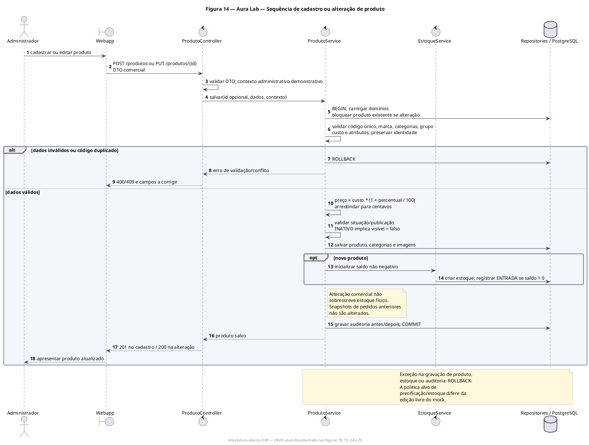
```plantuml
@startuml
footer Arquitetura alvo do DVP — CRUD atual documentado nas figuras 18, 19, 24 e 25
skinparam backgroundColor white
skinparam shadowing false
skinparam defaultFontName Arial
skinparam defaultFontSize 13
skinparam ArrowColor #374151
skinparam packageStyle rectangle
skinparam componentStyle rectangle
skinparam classAttributeIconSize 0
skinparam roundcorner 6
skinparam NoteBackgroundColor #FFF8DC
skinparam NoteBorderColor #9CA3AF
skinparam PackageBackgroundColor #F3F6FA
skinparam PackageBorderColor #64748B
skinparam ClassBackgroundColor #FFFFFF
skinparam ClassBorderColor #64748B
skinparam wrapWidth 220

title Figura 14 — Aura Lab — Sequência de cadastro ou alteração de produto

autonumber
actor Administrador as Admin
boundary Webapp
control ProdutoController as API
control ProdutoService as Produto
control EstoqueService as Estoque
database "Repositories / PostgreSQL" as DB
Admin -> Webapp : cadastrar ou editar produto
Webapp -> API : POST /produtos ou PUT /produtos/{id}\nDTO comercial
API -> API : validar DTO; contexto administrativo demonstrativo
API -> Produto : salvar(id opcional, dados, contexto)
Produto -> DB : BEGIN; carregar domínios\nbloquear produto existente se alteração
Produto -> Produto : validar código único, marca, categorias, grupo\ncusto e atributos; preservar identidade
alt dados inválidos ou código duplicado
  Produto -> DB : ROLLBACK
  Produto --> API : erro de validação/conflito
  API --> Webapp : 400/409 e campos a corrigir
else dados válidos
  Produto -> Produto : preço = custo * (1 + percentual / 100)\narredondar para centavos
  Produto -> Produto : validar situação/publicação\nINATIVO implica visível = falso
  Produto -> DB : salvar produto, categorias e imagens
  opt novo produto
    Produto -> Estoque : inicializar saldo não negativo
    Estoque -> DB : criar estoque; registrar ENTRADA se saldo > 0
  end
  note right of Produto
    Alteração comercial não sobrescreve estoque físico.
    Snapshots de pedidos anteriores não são alterados.
  end note
  Produto -> DB : gravar auditoria antes/depois; COMMIT
  Produto --> API : produto salvo
  API --> Webapp : 201 no cadastro / 200 na alteração
  Webapp --> Admin : apresentar produto atualizado
end
note over Produto, DB
  Exceção na gravação de produto, estoque ou auditoria: ROLLBACK.
  A política alvo de precificação/estoque difere da edição livre do mock.
end note

@enduml
```

## Figura 15 — Implantação local e testes isolados
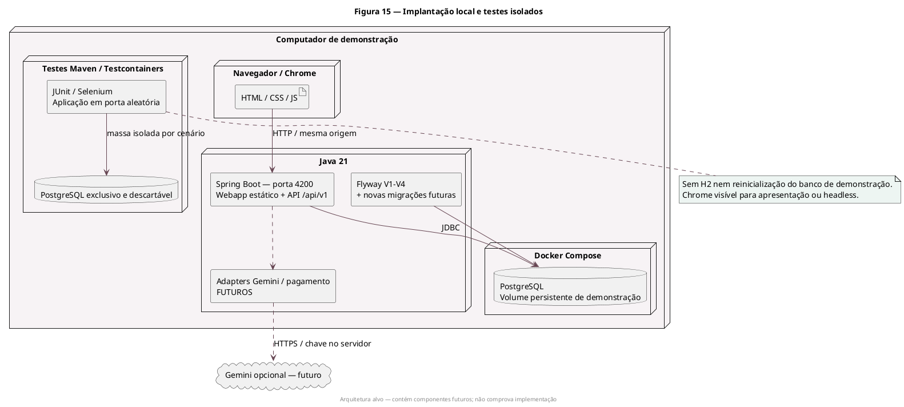
```plantuml
@startuml
skinparam backgroundColor white
skinparam shadowing false
skinparam defaultFontName Arial
skinparam defaultFontSize 14
skinparam classAttributeIconSize 0
skinparam packageStyle rectangle
skinparam componentStyle rectangle
skinparam ArrowColor #63424F
skinparam ClassBackgroundColor #FFF8E6
skinparam PackageBackgroundColor #F7F3F5
skinparam NoteBackgroundColor #EDF5F2
skinparam nodesep 30
skinparam ranksep 40
hide empty members
title Figura 15 — Implantação local e testes isolados
footer Arquitetura alvo — contém componentes futuros; não comprova implementação
node "Computador de demonstração" {
 node "Navegador / Chrome" {
  artifact "HTML / CSS / JS" as Web
 }
 node "Java 21" {
  component "Spring Boot — porta 4200\nWebapp estático + API /api/v1" as App
  component "Flyway V1–V4\n+ novas migrações futuras" as Flyway
  component "Adapters Gemini / pagamento\nFUTUROS" as Integration
 }
 node "Docker Compose" {
  database "PostgreSQL\nVolume persistente de demonstração" as DB
 }
 node "Testes Maven / Testcontainers" {
  component "JUnit / Selenium\nAplicação em porta aleatória" as Tests
  database "PostgreSQL exclusivo e descartável" as TestDB
 }
}
cloud "Gemini opcional — futuro" as Gemini
Web --> App : HTTP / mesma origem
App --> DB : JDBC
Flyway --> DB
App ..> Integration
Integration ..> Gemini : HTTPS / chave no servidor
Tests --> TestDB : massa isolada por cenário
note bottom of Tests
 Sem H2 nem reinicialização do banco de demonstração.
 Chrome visível para apresentação ou headless.
end note
@enduml
```

## Aura Lab — Modelo lógico de dados
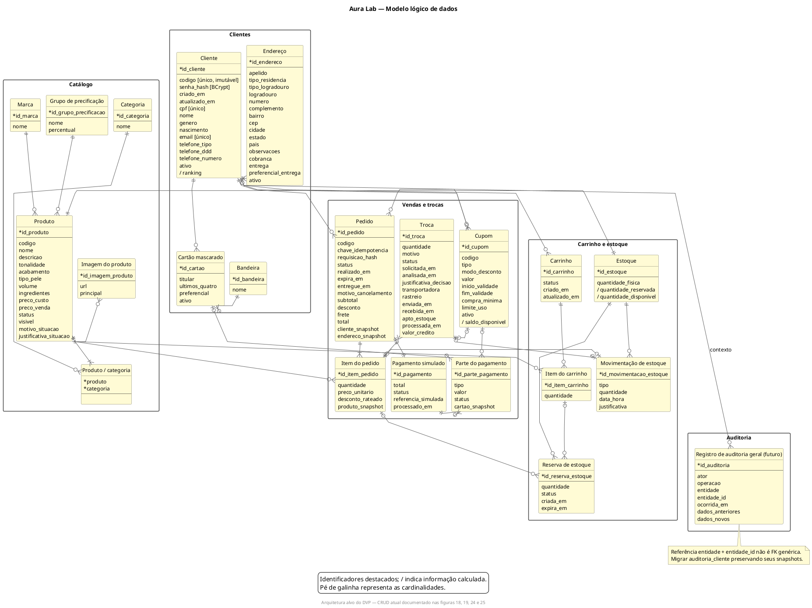
```plantuml
@startuml
footer Arquitetura alvo do DVP — CRUD atual documentado nas figuras 18, 19, 24 e 25
title Aura Lab — Modelo lógico de dados
hide circle
top to bottom direction
skinparam linetype polyline
set namespaceSeparator none
skinparam backgroundColor white
skinparam shadowing false
skinparam defaultFontName Arial
skinparam defaultFontSize 12
skinparam packageStyle rectangle
skinparam classAttributeIconSize 0
skinparam ClassBackgroundColor #FFFBD5
skinparam ClassBorderColor #777766
skinparam PackageBackgroundColor white
skinparam PackageBorderColor #444444
skinparam ArrowColor #666666
skinparam NoteBackgroundColor #FFFBD5
skinparam NoteBorderColor #777766
skinparam nodesep 12
skinparam ranksep 18
together {
package "Clientes" as PClientes {

entity "Cliente" as cliente {
* id_cliente
--
codigo [único, imutável]
senha_hash [BCrypt]
criado_em
atualizado_em
cpf [único]
nome
genero
nascimento
email [único]
telefone_tipo
telefone_ddd
telefone_numero
ativo
/ ranking
}
entity "Endereço" as endereco {
* id_endereco
--
apelido
tipo_residencia
tipo_logradouro
logradouro
numero
complemento
bairro
cep
cidade
estado
pais
observacoes
cobranca
entrega
preferencial_entrega
ativo
}
entity "Bandeira" as bandeira {
* id_bandeira
--
nome
}
entity "Cartão mascarado" as cartao {
* id_cartao
--
titular
ultimos_quatro
preferencial
ativo
}
}
package "Catálogo" as PCatalogo {
entity "Marca" as marca {
* id_marca
--
nome
}
entity "Grupo de precificação" as grupo_precificacao {
* id_grupo_precificacao
--
nome
percentual
}
entity "Categoria" as categoria {
* id_categoria
--
nome
}
entity "Produto" as produto {
* id_produto
--
codigo
nome
descricao
tonalidade
acabamento
tipo_pele
volume
ingredientes
preco_custo
preco_venda
status
visivel
motivo_situacao
justificativa_situacao
}
entity "Produto / categoria" as produto_categoria {
* produto
* categoria
--

}
entity "Imagem do produto" as imagem_produto {
* id_imagem_produto
--
url
principal
}
}
}
together {
package "Carrinho e estoque" as PEstoque {
entity "Carrinho" as carrinho {
* id_carrinho
--
status
criado_em
atualizado_em
}
entity "Item do carrinho" as item_carrinho {
* id_item_carrinho
--
quantidade
}
entity "Estoque" as estoque {
* id_estoque
--
quantidade_fisica
/ quantidade_reservada
/ quantidade_disponivel
}
entity "Reserva de estoque" as reserva_estoque {
* id_reserva_estoque
--
quantidade
status
criada_em
expira_em
}
entity "Movimentação de estoque" as movimentacao_estoque {
* id_movimentacao_estoque
--
tipo
quantidade
data_hora
justificativa
}
}
package "Vendas e trocas" as PVendas {
entity "Pedido" as pedido {
* id_pedido
--
codigo
chave_idempotencia
requisicao_hash
status
realizado_em
expira_em
entregue_em
motivo_cancelamento
subtotal
desconto
frete
total
cliente_snapshot
endereco_snapshot
}
entity "Item do pedido" as item_pedido {
* id_item_pedido
--
quantidade
preco_unitario
desconto_rateado
produto_snapshot
}
entity "Pagamento simulado" as pagamento {
* id_pagamento
--
total
status
referencia_simulada
processado_em
}
entity "Parte do pagamento" as parte_pagamento {
* id_parte_pagamento
--
tipo
valor
status
cartao_snapshot
}
entity "Cupom" as cupom {
* id_cupom
--
codigo
tipo
modo_desconto
valor
inicio_validade
fim_validade
compra_minima
limite_uso
ativo
/ saldo_disponivel
}
entity "Troca" as troca {
* id_troca
--
quantidade
motivo
status
solicitada_em
analisada_em
justificativa_decisao
transportadora
rastreio
enviada_em
recebida_em
apto_estoque
processada_em
valor_credito
}
}
package "Auditoria" as PAuditoria {
entity "Registro de auditoria geral (futuro)" as auditoria {
* id_auditoria
--
ator
operacao
entidade
entidade_id
ocorrida_em
dados_anteriores
dados_novos
}
}

}

cliente |o-[norank]-o{ auditoria : contexto

note bottom of auditoria
 Referência entidade + entidade_id não é FK genérica.
 Migrar auditoria_cliente preservando seus snapshots.
end note

cliente ||-[norank]-|{ endereco
cliente ||-[norank]-o{ cartao
bandeira ||-[norank]-o{ cartao
cliente ||-[norank]-o{ carrinho
cliente ||-[norank]-o{ pedido
marca ||-[norank]-o{ produto
grupo_precificacao ||-[norank]-o{ produto
produto ||-[norank]-|{ produto_categoria
categoria ||-[norank]-o{ produto_categoria
produto ||-[norank]-o{ imagem_produto
produto ||-[norank]-|| estoque
carrinho ||-[norank]-o{ item_carrinho
produto ||-[norank]-o{ item_carrinho
estoque ||-[norank]-o{ reserva_estoque
item_carrinho |o-[norank]-o{ reserva_estoque
item_pedido |o-[norank]-o{ reserva_estoque
estoque ||-[norank]-o{ movimentacao_estoque
item_pedido |o-[norank]-o| movimentacao_estoque
troca |o-[norank]-o| movimentacao_estoque
pedido ||-[norank]-|{ item_pedido
produto ||-[norank]-o{ item_pedido
pedido ||-[norank]-|| pagamento
pagamento ||-[norank]-o{ parte_pagamento
cartao |o-[norank]-o{ parte_pagamento
cupom |o-[norank]-o{ parte_pagamento
cupom |o-[norank]-o{ pedido
cliente |o-[norank]-o{ cupom
item_pedido ||-[norank]-o{ troca
troca |o-[norank]-o| cupom


cliente -[hidden]right-> endereco
cliente -[hidden]down-> cartao
cartao -[hidden]right-> bandeira
marca -[hidden]right-> grupo_precificacao
grupo_precificacao -[hidden]right-> categoria
marca -[hidden]down-> produto
produto -[hidden]right-> imagem_produto
imagem_produto -[hidden]down-> produto_categoria
pedido -[hidden]right-> troca
troca -[hidden]right-> cupom
pedido -[hidden]down-> item_pedido
item_pedido -[hidden]right-> pagamento
pagamento -[hidden]right-> parte_pagamento
carrinho -[hidden]right-> estoque
carrinho -[hidden]down-> item_carrinho
item_carrinho -[hidden]down-> reserva_estoque
estoque -[hidden]down-> movimentacao_estoque
cliente -[hidden]right-> marca
cliente -[hidden]down-> pedido
marca -[hidden]down-> carrinho
pedido -[hidden]right-> carrinho
movimentacao_estoque -[hidden]down-> auditoria
legend bottom
  Identificadores destacados; / indica informação calculada.
  Pé de galinha representa as cardinalidades.
endlegend
@enduml
```

## Aura Lab — Modelo relacional

```plantuml
@startuml
footer Arquitetura alvo do DVP — CRUD atual documentado nas figuras 18, 19, 24 e 25
title Aura Lab — Modelo relacional
hide circle
top to bottom direction
skinparam linetype polyline
set namespaceSeparator none
skinparam backgroundColor white
skinparam shadowing false
skinparam defaultFontName Arial
skinparam defaultFontSize 12
skinparam packageStyle rectangle
skinparam classAttributeIconSize 0
skinparam ClassBackgroundColor #FFFBD5
skinparam ClassBorderColor #777766
skinparam PackageBackgroundColor white
skinparam PackageBorderColor #444444
skinparam ArrowColor #666666
skinparam NoteBackgroundColor #FFFBD5
skinparam NoteBorderColor #777766
skinparam nodesep 12
skinparam ranksep 18
together {
package "Clientes" as PClientes {

entity "cliente" as cliente {
* id : BIGINT <<PK>>
--
* codigo : VARCHAR(20) <<UK, imutável>>
* senha_hash : VARCHAR(100)
* criado_em : TIMESTAMPTZ
* atualizado_em : TIMESTAMPTZ
* cpf : VARCHAR(11) <<UK>>
* email : VARCHAR(254) <<UK>>
* nome : VARCHAR(150)
* genero : VARCHAR(40)
* nascimento : DATE
* telefone_tipo : VARCHAR(20)
* telefone_ddd : VARCHAR(2)
* telefone_numero : VARCHAR(9)
* ativo : BOOLEAN
}
entity "endereco" as endereco {
* id : BIGINT <<PK>>
--
* cliente_id : BIGINT <<FK>>
* apelido : VARCHAR(60)
* tipo_residencia : VARCHAR(40)
* tipo_logradouro : VARCHAR(40)
* logradouro : VARCHAR(160)
* numero : VARCHAR(20)
complemento : VARCHAR(100)
* bairro : VARCHAR(100)
* cep : VARCHAR(8)
* cidade : VARCHAR(100)
* estado : VARCHAR(60)
* pais : VARCHAR(60)
observacoes : VARCHAR(500)
* cobranca : BOOLEAN
* entrega : BOOLEAN
* preferencial_entrega : BOOLEAN
* ativo : BOOLEAN
}
entity "bandeira" as bandeira {
* id : BIGINT <<PK>>
--
* nome : VARCHAR(40) <<UK>>
}
entity "cartao" as cartao {
* id : BIGINT <<PK>>
--
* cliente_id : BIGINT <<FK>>
* bandeira_id : BIGINT <<FK>>
* titular : VARCHAR(150)
* ultimos_quatro : VARCHAR(4)
* preferencial : BOOLEAN
* ativo : BOOLEAN
}
}
package "Catálogo" as PCatalogo {
entity "marca" as marca {
* id : BIGINT <<PK>>
--
* nome : VARCHAR(100) <<UK>>
}
entity "grupo_precificacao" as grupo_precificacao {
* id : BIGINT <<PK>>
--
* nome : VARCHAR(100) <<UK>>
* percentual : NUMERIC(7,2)
}
entity "categoria" as categoria {
* id : BIGINT <<PK>>
--
* nome : VARCHAR(100) <<UK>>
}
entity "produto" as produto {
* id : BIGINT <<PK>>
--
* marca_id : BIGINT <<FK>>
* grupo_precificacao_id : BIGINT <<FK>>
* codigo : VARCHAR(40) <<UK>>
* nome : VARCHAR(150)
* descricao : TEXT
tonalidade : VARCHAR(80)
acabamento : VARCHAR(80)
tipo_pele : VARCHAR(80)
volume : VARCHAR(40)
ingredientes : TEXT
* preco_custo : NUMERIC(12,2)
* preco_venda : NUMERIC(12,2)
* status : VARCHAR(10)
* visivel : BOOLEAN
motivo_situacao : VARCHAR(80)
justificativa_situacao : TEXT
}
entity "produto_categoria" as produto_categoria {
* produto_id : BIGINT <<PK, FK>>
* categoria_id : BIGINT <<PK, FK>>
}
entity "imagem_produto" as imagem_produto {
* id : BIGINT <<PK>>
--
* produto_id : BIGINT <<FK>>
* url : TEXT
* principal : BOOLEAN
}
}
}
together {
package "Carrinho e estoque" as PEstoque {
entity "carrinho" as carrinho {
* id : BIGINT <<PK>>
--
* cliente_id : BIGINT <<FK>>
* status : VARCHAR(12)
* criado_em : TIMESTAMPTZ
* atualizado_em : TIMESTAMPTZ
}
entity "item_carrinho" as item_carrinho {
* id : BIGINT <<PK>>
--
* carrinho_id : BIGINT <<FK>>
* produto_id : BIGINT <<FK>>
* quantidade : INTEGER
}
entity "estoque" as estoque {
* id : BIGINT <<PK>>
--
* produto_id : BIGINT <<FK, UK>>
* quantidade_fisica : INTEGER
}
entity "reserva_estoque" as reserva_estoque {
* id : BIGINT <<PK>>
--
* estoque_id : BIGINT <<FK>>
item_carrinho_id : BIGINT <<FK>>
item_pedido_id : BIGINT <<FK>>
* quantidade : INTEGER
* status : VARCHAR(12)
* criada_em : TIMESTAMPTZ
* expira_em : TIMESTAMPTZ
}
entity "movimentacao_estoque" as movimentacao_estoque {
* id : BIGINT <<PK>>
--
* estoque_id : BIGINT <<FK>>
item_pedido_id : BIGINT <<FK, UK>>
troca_id : BIGINT <<FK, UK>>
* tipo : VARCHAR(12)
* quantidade : INTEGER
* data_hora : TIMESTAMPTZ
* justificativa : TEXT
}
}
package "Vendas e trocas" as PVendas {
entity "pedido" as pedido {
* id : BIGINT <<PK>>
--
* cliente_id : BIGINT <<FK>>
cupom_promocional_id : BIGINT <<FK>>
* codigo : VARCHAR(40) <<UK>>
* chave_idempotencia : VARCHAR(80)
* requisicao_hash : CHAR(64)
* status : VARCHAR(25)
* realizado_em : TIMESTAMPTZ
* expira_em : TIMESTAMPTZ
entregue_em : TIMESTAMPTZ
motivo_cancelamento : VARCHAR(80)
* cliente_snapshot : JSONB
* endereco_snapshot : JSONB
* subtotal : NUMERIC(12,2)
* desconto : NUMERIC(12,2)
* frete : NUMERIC(12,2)
* total : NUMERIC(12,2)
}
entity "item_pedido" as item_pedido {
* id : BIGINT <<PK>>
--
* pedido_id : BIGINT <<FK>>
* produto_id : BIGINT <<FK>>
* quantidade : INTEGER
* preco_unitario : NUMERIC(12,2)
* desconto_rateado : NUMERIC(12,2)
* produto_snapshot : JSONB
}
entity "pagamento_simulado" as pagamento {
* id : BIGINT <<PK>>
--
* pedido_id : BIGINT <<FK, UK>>
* status : VARCHAR(12)
* total : NUMERIC(12,2)
referencia_simulada : VARCHAR(100)
processado_em : TIMESTAMPTZ
}
entity "parte_pagamento" as parte_pagamento {
* id : BIGINT <<PK>>
--
* pagamento_id : BIGINT <<FK>>
* tipo : VARCHAR(15)
* valor : NUMERIC(12,2)
* status : VARCHAR(12)
cartao_id : BIGINT <<FK>>
cartao_snapshot : JSONB
cupom_troca_id : BIGINT <<FK>>
}
entity "cupom" as cupom {
* id : BIGINT <<PK>>
--
* codigo : VARCHAR(40) <<UK>>
* tipo : VARCHAR(12)
* valor : NUMERIC(12,2)
* inicio_validade : DATE
* fim_validade : DATE
* ativo : BOOLEAN
modo_desconto : VARCHAR(12)
compra_minima : NUMERIC(12,2)
limite_uso : INTEGER
cliente_id : BIGINT <<FK>>
troca_origem_id : BIGINT <<FK, UK>>
}
entity "troca" as troca {
* id : BIGINT <<PK>>
--
* item_pedido_id : BIGINT <<FK>>
* quantidade : INTEGER
* motivo : TEXT
* status : VARCHAR(20)
* solicitada_em : TIMESTAMPTZ
analisada_em : TIMESTAMPTZ
justificativa_decisao : TEXT
transportadora : VARCHAR(100)
rastreio : VARCHAR(100)
enviada_em : TIMESTAMPTZ
recebida_em : TIMESTAMPTZ
apto_estoque : BOOLEAN
processada_em : TIMESTAMPTZ
valor_credito : NUMERIC(12,2)
}
}
package "Auditoria" as PAuditoria {
entity "registro_auditoria" as auditoria {
* id : BIGINT <<PK>>
--
cliente_id : BIGINT <<FK>>
* ator : VARCHAR(80)
* operacao : VARCHAR(80)
* entidade : VARCHAR(80)
* entidade_id : BIGINT
* ocorrida_em : TIMESTAMPTZ
dados_anteriores : JSONB
dados_novos : JSONB
}
}

}

cliente |o-[norank]-o{ auditoria : contexto

note bottom of auditoria
 Referência entidade + entidade_id não é FK genérica.
 Migrar auditoria_cliente preservando seus snapshots.
end note

cliente ||-[norank]-|{ endereco
cliente ||-[norank]-o{ cartao
bandeira ||-[norank]-o{ cartao
cliente ||-[norank]-o{ carrinho
cliente ||-[norank]-o{ pedido
marca ||-[norank]-o{ produto
grupo_precificacao ||-[norank]-o{ produto
produto ||-[norank]-|{ produto_categoria
categoria ||-[norank]-o{ produto_categoria
produto ||-[norank]-o{ imagem_produto
produto ||-[norank]-|| estoque
carrinho ||-[norank]-o{ item_carrinho
produto ||-[norank]-o{ item_carrinho
estoque ||-[norank]-o{ reserva_estoque
item_carrinho |o-[norank]-o{ reserva_estoque
item_pedido |o-[norank]-o{ reserva_estoque
estoque ||-[norank]-o{ movimentacao_estoque
item_pedido |o-[norank]-o| movimentacao_estoque
troca |o-[norank]-o| movimentacao_estoque
pedido ||-[norank]-|{ item_pedido
produto ||-[norank]-o{ item_pedido
pedido ||-[norank]-|| pagamento
pagamento ||-[norank]-o{ parte_pagamento
cartao |o-[norank]-o{ parte_pagamento
cupom |o-[norank]-o{ parte_pagamento
cupom |o-[norank]-o{ pedido
cliente |o-[norank]-o{ cupom
item_pedido ||-[norank]-o{ troca
troca |o-[norank]-o| cupom


cliente -[hidden]right-> endereco
cliente -[hidden]down-> cartao
cartao -[hidden]right-> bandeira
marca -[hidden]right-> grupo_precificacao
grupo_precificacao -[hidden]right-> categoria
marca -[hidden]down-> produto
produto -[hidden]right-> imagem_produto
imagem_produto -[hidden]down-> produto_categoria
pedido -[hidden]right-> troca
troca -[hidden]right-> cupom
pedido -[hidden]down-> item_pedido
item_pedido -[hidden]right-> pagamento
pagamento -[hidden]right-> parte_pagamento
carrinho -[hidden]right-> estoque
carrinho -[hidden]down-> item_carrinho
item_carrinho -[hidden]down-> reserva_estoque
estoque -[hidden]down-> movimentacao_estoque
cliente -[hidden]right-> marca
cliente -[hidden]down-> pedido
marca -[hidden]down-> carrinho
pedido -[hidden]right-> carrinho
movimentacao_estoque -[hidden]down-> auditoria
legend bottom
  * = NOT NULL | PK = chave primária | FK = chave estrangeira | UK = único.
  IDs BIGINT gerados por IDENTITY, exceto FKs e chave composta.
  Campos sem * aceitam NULL. Estados: VARCHAR com CHECK.
  Regras condicionais e transacionais: REGRAS-E-MIGRACAO.md.
endlegend
@enduml


```

## Figura 18 — Casos de uso do CRUD implementado
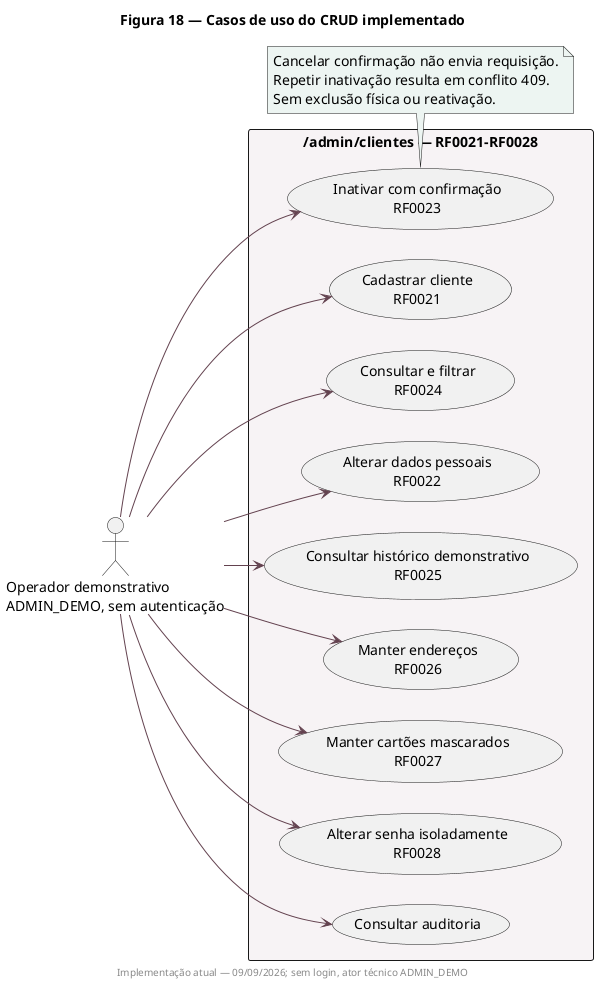
```plantuml
@startuml
skinparam backgroundColor white
skinparam shadowing false
skinparam defaultFontName Arial
skinparam defaultFontSize 14
skinparam classAttributeIconSize 0
skinparam packageStyle rectangle
skinparam componentStyle rectangle
skinparam ArrowColor #63424F
skinparam ClassBackgroundColor #FFF8E6
skinparam PackageBackgroundColor #F7F3F5
skinparam NoteBackgroundColor #EDF5F2
skinparam nodesep 30
skinparam ranksep 40
hide empty members
title Figura 18 — Casos de uso do CRUD implementado
footer Implementação atual — 09/09/2026; sem login, ator técnico ADMIN_DEMO
left to right direction
actor "Operador demonstrativo\nADMIN_DEMO, sem autenticação" as Admin
rectangle "/admin/clientes — RF0021–RF0028" {
 usecase "Cadastrar cliente\nRF0021" as Create
 usecase "Consultar e filtrar\nRF0024" as Read
 usecase "Alterar dados pessoais\nRF0022" as Update
 usecase "Inativar com confirmação\nRF0023" as Disable
 usecase "Consultar histórico demonstrativo\nRF0025" as History
 usecase "Manter endereços\nRF0026" as Address
 usecase "Manter cartões mascarados\nRF0027" as Card
 usecase "Alterar senha isoladamente\nRF0028" as Password
 usecase "Consultar auditoria" as Audit
}
Admin --> Create
Admin --> Read
Admin --> Update
Admin --> Disable
Admin --> History
Admin --> Address
Admin --> Card
Admin --> Password
Admin --> Audit
note bottom of Disable
 Cancelar confirmação não envia requisição.
 Repetir inativação resulta em conflito 409.
 Sem exclusão física ou reativação.
end note
@enduml
```

## Figura 19 — Escrita do CRUD e auditoria atômica
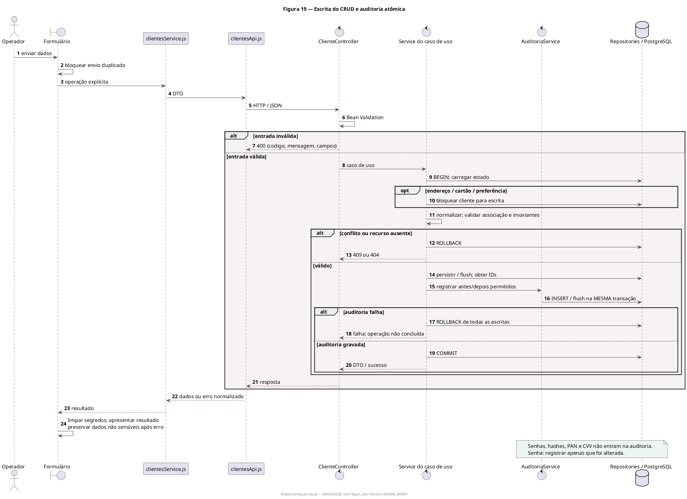
```plantuml
@startuml
skinparam backgroundColor white
skinparam shadowing false
skinparam defaultFontName Arial
skinparam defaultFontSize 14
skinparam classAttributeIconSize 0
skinparam packageStyle rectangle
skinparam componentStyle rectangle
skinparam ArrowColor #63424F
skinparam ClassBackgroundColor #FFF8E6
skinparam PackageBackgroundColor #F7F3F5
skinparam NoteBackgroundColor #EDF5F2
skinparam nodesep 30
skinparam ranksep 40
hide empty members
title Figura 19 — Escrita do CRUD e auditoria atômica
footer Implementação atual — 09/09/2026; sem login, ator técnico ADMIN_DEMO
autonumber
actor Operador
boundary "Formulário" as UI
participant "clientesService.js" as Facade
participant "clientesApi.js" as Adapter
control ClienteController as API
control "Service do caso de uso" as S
control AuditoriaService as Audit
database "Repositories / PostgreSQL" as DB
Operador -> UI : enviar dados
UI -> UI : bloquear envio duplicado
UI -> Facade : operação explícita
Facade -> Adapter : DTO
Adapter -> API : HTTP / JSON
API -> API : Bean Validation
alt entrada inválida
 API --> Adapter : 400 {codigo, mensagem, campos}
else entrada válida
 API -> S : caso de uso
 S -> DB : BEGIN; carregar estado
 opt endereço / cartão / preferência
  S -> DB : bloquear cliente para escrita
 end
 S -> S : normalizar; validar associação e invariantes
 alt conflito ou recurso ausente
  S -> DB : ROLLBACK
  S --> API : 409 ou 404
 else válido
  S -> DB : persistir / flush; obter IDs
  S -> Audit : registrar antes/depois permitidos
  Audit -> DB : INSERT / flush na MESMA transação
  alt auditoria falha
   S -> DB : ROLLBACK de todas as escritas
   S --> API : falha; operação não concluída
  else auditoria gravada
   S -> DB : COMMIT
   S --> API : DTO / sucesso
  end
 end
 API --> Adapter : resposta
end
Adapter --> Facade : dados ou erro normalizado
Facade --> UI : resultado
UI -> UI : limpar segredos; apresentar resultado\npreservar dados não sensíveis após erro
note over Audit, DB
 Senhas, hashes, PAN e CVV não entram na auditoria.
 Senha: registrar apenas que foi alterada.
end note
@enduml
```

## Figura 20 — Estados do pedido na solução alvo
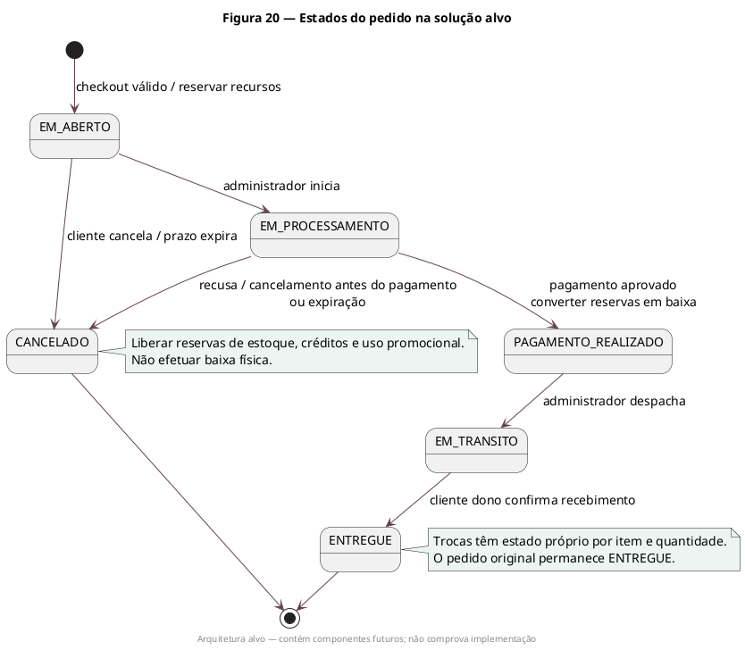
```plantuml
@startuml
skinparam backgroundColor white
skinparam shadowing false
skinparam defaultFontName Arial
skinparam defaultFontSize 14
skinparam classAttributeIconSize 0
skinparam packageStyle rectangle
skinparam componentStyle rectangle
skinparam ArrowColor #63424F
skinparam ClassBackgroundColor #FFF8E6
skinparam PackageBackgroundColor #F7F3F5
skinparam NoteBackgroundColor #EDF5F2
skinparam nodesep 30
skinparam ranksep 40
hide empty members
title Figura 20 — Estados do pedido na solução alvo
footer Arquitetura alvo — contém componentes futuros; não comprova implementação
[*] --> EM_ABERTO : checkout válido / reservar recursos
EM_ABERTO --> EM_PROCESSAMENTO : administrador inicia
EM_PROCESSAMENTO --> PAGAMENTO_REALIZADO : pagamento aprovado\nconverter reservas em baixa
PAGAMENTO_REALIZADO --> EM_TRANSITO : administrador despacha
EM_TRANSITO --> ENTREGUE : cliente dono confirma recebimento
EM_ABERTO --> CANCELADO : cliente cancela / prazo expira
EM_PROCESSAMENTO --> CANCELADO : recusa / cancelamento antes do pagamento\nou expiração
ENTREGUE --> [*]
CANCELADO --> [*]
note right of CANCELADO
 Liberar reservas de estoque, créditos e uso promocional.
 Não efetuar baixa física.
end note
note right of ENTREGUE
 Trocas têm estado próprio por item e quantidade.
 O pedido original permanece ENTREGUE.
end note
@enduml
```

## Figura 21 — Troca por item e quantidade
```plantuml
@startuml
skinparam backgroundColor white
skinparam shadowing false
skinparam defaultFontName Arial
skinparam defaultFontSize 14
skinparam classAttributeIconSize 0
skinparam packageStyle rectangle
skinparam componentStyle rectangle
skinparam ArrowColor #63424F
skinparam ClassBackgroundColor #FFF8E6
skinparam PackageBackgroundColor #F7F3F5
skinparam NoteBackgroundColor #EDF5F2
skinparam nodesep 30
skinparam ranksep 40
hide empty members
title Figura 21 — Troca por item e quantidade
footer Arquitetura alvo — contém componentes futuros; não comprova implementação
[*] --> TROCA_SOLICITADA : cliente / pedido ENTREGUE
TROCA_SOLICITADA --> TROCA_ACEITA : administrador aceita
TROCA_SOLICITADA --> TROCA_NEGADA : administrador justifica recusa
TROCA_ACEITA --> ITEM_ENVIADO : cliente informa despacho
ITEM_ENVIADO --> ITEM_RECEBIDO : administrador recebe e avalia aptidão
ITEM_RECEBIDO --> TROCA_PROCESSADA : gerar cupom do cliente\ne reentrada somente se apto
TROCA_NEGADA --> [*]
TROCA_PROCESSADA --> [*]
note right of TROCA_PROCESSADA
 Cupom, eventual reentrada e auditoria na mesma transação.
 Idempotência impede duplicar crédito ou estoque.
 Quantidade acumulada não pode exceder a comprada.
end note
@enduml
```

## Figura 22 — CRUD simples, sem autenticação
```plantuml
@startuml
skinparam shadowing false
skinparam defaultFontName Arial
skinparam classAttributeIconSize 0
hide empty members
title Figura 22 — CRUD simples, sem autenticação
class ClienteController
class ClienteService {
 cadastrar()
 consultar()
 alterar()
 inativar()
 alterarSenha()
}
class EnderecoService {
 manterEnderecos()
 validarFinalidades()
}
class CartaoService {
 manterCartoes()
 definirPreferencial()
 listarBandeiras()
}
class TransacaoService {
 consultarHistorico()
}
class AuditoriaService {
 registrarAlteracao()
}
ClienteController --> ClienteService
ClienteController --> EnderecoService
ClienteController --> CartaoService
ClienteController --> TransacaoService
ClienteController --> AuditoriaService : consultar
ClienteService --> AuditoriaService
EnderecoService --> AuditoriaService
CartaoService --> AuditoriaService
note bottom of ClienteService
 Senha é um dado do cliente, armazenado como hash BCrypt.
 Alteração independente, sem criar login ou sessão.
end note
footer ADMIN_DEMO é um ator técnico definido pelo servidor.
@enduml
```

## Figura 23 — Testes, padrões e evidências do CRUD
```plantuml
@startuml
skinparam backgroundColor white
skinparam shadowing false
skinparam defaultFontName Arial
skinparam defaultFontSize 14
skinparam classAttributeIconSize 0
skinparam packageStyle rectangle
skinparam componentStyle rectangle
skinparam ArrowColor #63424F
skinparam ClassBackgroundColor #FFF8E6
skinparam PackageBackgroundColor #F7F3F5
skinparam NoteBackgroundColor #EDF5F2
skinparam nodesep 30
skinparam ranksep 40
hide empty members
title Figura 23 — Testes, padrões e evidências do CRUD
footer Implementação atual — 09/09/2026; sem login, ator técnico ADMIN_DEMO
component "Maven Wrapper / testar-crud.ps1" as Runner
component "Selenium + JUnit 5\nClienteCrudIT" as UI
package "Page Objects" {
 [ClientesAdminPage] as Page
 [FormularioComponente / EnderecoComponente\nCartaoComponente / ConfirmacaoComponente] as Components
}
component "JUnit / Mockito\nAPI / integridade / migração / reinício" as Tests
component "PoliticaRankingPorComprasTest\nStrategy sem HTTP ou banco" as Unit
component "ArquiteturaTest\nControllers / Mapper sem Repository" as Architecture
component "ConsultaPerformanceTest\n1.000 clientes / 30 execuções por consulta" as Perf
node "Testcontainers PostgreSQL\nMigrações reais / massa por cenário" as DB
artifact "HTML / capturas / matriz RF-RN-teste-evidência" as Report
Runner --> UI
Runner --> Tests
Runner --> Unit
Runner --> Architecture
Runner --> Perf
UI --> Page
Page --> Components
UI --> DB : aplicação isolada
Tests --> DB
Perf --> DB
Runner --> Report
@enduml
```

## Figura 24 — Domínio do CRUD atual
```plantuml
@startuml
skinparam backgroundColor white
skinparam shadowing false
skinparam defaultFontName Arial
skinparam defaultFontSize 14
skinparam classAttributeIconSize 0
skinparam packageStyle rectangle
skinparam componentStyle rectangle
skinparam ArrowColor #63424F
skinparam ClassBackgroundColor #FFF8E6
skinparam PackageBackgroundColor #F7F3F5
skinparam NoteBackgroundColor #EDF5F2
skinparam nodesep 30
skinparam ranksep 40
hide empty members

footer Implementado — sem autenticação; ADMIN_DEMO é ator técnico
title Figura 24 — Domínio do CRUD atual
hide methods
class Cliente {
 id: Long
 codigo: String <<unique, immutable>>
 cpf: String <<unique>>
 email: String <<unique>>
 nome: String
 genero: String
 nascimento: LocalDate
 telefoneTipo: String
 telefoneDdd: String
 telefoneNumero: String
 senhaHash: String <<BCrypt>>
 criadoEm: OffsetDateTime
 atualizadoEm: OffsetDateTime
 ativo: boolean
 /ranking: int
}
class Endereco {
 id: Long
 apelido: String
 tipoResidencia: String
 tipoLogradouro: String
 logradouro: String
 numero: String
 complemento: String [0..1]
 bairro: String
 cep: String
 cidade: String
 estado: String
 pais: String
 observacoes: String [0..1]
 cobranca: boolean
 entrega: boolean
 preferencialEntrega: boolean
 ativo: boolean
}
class Cartao {
 id: Long
 titular: String
 ultimosQuatro: String
 preferencial: boolean
 ativo: boolean
}
class Bandeira {
 id: Long
 nome: String
}
class TransacaoCliente <<demonstrativa>> {
 id: Long
 clienteId: Long
 codigo: String
 tipo: String
 status: String
 valor: BigDecimal
 ocorridaEm: OffsetDateTime
 detalhes: String
}
class AuditoriaCliente {
 id: Long
 clienteId: Long
 ator: String
 entidade: String
 entidadeId: Long [0..1]
 operacao: String
 ocorridaEm: OffsetDateTime
 dadosAnteriores: JSONB [0..1]
 dadosNovos: JSONB [0..1]
 alteracoes: String <<compatibilidade>>
}
Cliente "1" -- "1..*" Endereco
Cliente "1" -- "0..*" Cartao
Cartao "0..*" -- "1" Bandeira
Cliente "1" -- "0..*" TransacaoCliente
Cliente "1" -- "0..*" AuditoriaCliente
note bottom of Cliente
 Sem login nesta entrega: ADMIN_DEMO é ator técnico.
 Modelo completo de vendas é futuro; sem autenticação.
 Inativação preserva vínculos; não há exclusão física.
end note
@enduml
```

## Figura 25 — Banco do CRUD atual V1–V4
```plantuml
@startuml
skinparam backgroundColor white
skinparam shadowing false
skinparam defaultFontName Arial
skinparam defaultFontSize 14
skinparam classAttributeIconSize 0
skinparam packageStyle rectangle
skinparam componentStyle rectangle
skinparam ArrowColor #63424F
skinparam ClassBackgroundColor #FFF8E6
skinparam PackageBackgroundColor #F7F3F5
skinparam NoteBackgroundColor #EDF5F2
skinparam nodesep 30
skinparam ranksep 40
hide empty members

footer Implementado — sem autenticação; ADMIN_DEMO é ator técnico
title Figura 25 — Banco do CRUD atual V1–V4
hide circle
entity cliente {
 * id : BIGINT <<PK, identity>>
 * codigo : VARCHAR(20) <<UK, immutable>>
 * nome : VARCHAR(150)
 * cpf : VARCHAR(11) <<UK>>
 * email : VARCHAR(254) <<UK normalizada>>
 * genero : VARCHAR(40)
 * nascimento : DATE
 * telefone_tipo : VARCHAR(20)
 * telefone_ddd : VARCHAR(2)
 * telefone_numero : VARCHAR(9)
 * senha_hash : VARCHAR(100)
 * ativo : BOOLEAN
 * criado_em : TIMESTAMPTZ
 * atualizado_em : TIMESTAMPTZ
}
entity endereco {
 * id : BIGINT <<PK, identity>>
 * cliente_id : BIGINT <<FK>>
 * apelido : VARCHAR(60)
 * tipo_residencia : VARCHAR(40)
 * tipo_logradouro : VARCHAR(40)
 * logradouro : VARCHAR(160)
 * numero : VARCHAR(20)
 complemento : VARCHAR(100)
 * bairro : VARCHAR(100)
 * cep : VARCHAR(8)
 * cidade : VARCHAR(100)
 * estado : VARCHAR(60)
 * pais : VARCHAR(60)
 observacoes : VARCHAR(500)
 * cobranca : BOOLEAN
 * entrega : BOOLEAN
 * preferencial_entrega : BOOLEAN
 * ativo : BOOLEAN
}
entity bandeira {
 * id : BIGINT <<PK, identity>>
 * nome : VARCHAR(40) <<UK>>
}
entity cartao {
 * id : BIGINT <<PK, identity>>
 * cliente_id : BIGINT <<FK>>
 * bandeira_id : BIGINT <<FK>>
 * titular : VARCHAR(150)
 * ultimos_quatro : VARCHAR(4)
 * preferencial : BOOLEAN
 * ativo : BOOLEAN
}
entity transacao_cliente {
 * id : BIGINT <<PK, identity>>
 * cliente_id : BIGINT <<FK>>
 * codigo : VARCHAR(40) <<UK>>
 * tipo : VARCHAR(30)
 * status : VARCHAR(30)
 * valor : NUMERIC(12,2)
 * ocorrida_em : TIMESTAMPTZ
 detalhes : VARCHAR(500)
}
entity auditoria_cliente {
 * id : BIGINT <<PK, identity>>
 * cliente_id : BIGINT <<FK>>
 * ocorrida_em : TIMESTAMPTZ
 * ator : VARCHAR(80)
 * operacao : VARCHAR(50)
 * entidade : VARCHAR(80)
 entidade_id : BIGINT
 dados_anteriores : JSONB
 dados_novos : JSONB
 * alteracoes : TEXT
}
cliente ||--o{ endereco
cliente ||--o{ cartao
bandeira ||--o{ cartao
cliente ||--o{ transacao_cliente
cliente ||--o{ auditoria_cliente
note right of cartao
 Índice único parcial em cliente_id
 WHERE ativo AND preferencial.
 PAN e CVV não são persistidos.
end note
note bottom of transacao_cliente
 Estrutura demonstrativa temporária.
 Não representa o modelo futuro completo de vendas.
end note
@enduml
```